# 階層式智慧代理架構與工具算小服務架構的融合設計
## HiBA-AB：Hierarchical Agent Based Architecture
### 結合 TPM 硬體信任、區塊鏈稽核與自然語言自主決策


## 一、研究背景與動機

### 1.1 問題界定

現有分散式 AI 代理框架面臨三項未解決的核心問題：

**第一個問題是「組合間隙（Coupling）」。** 現有框架（LangGraph、AutoGen、CrewAI）將 Agent 與 Tool 視為異質型別，導致新增代理時必須修改頂層管理邏輯。

**第二個問題是「資源缺失時的行為未定義」。** 當節點沒有對應資源時，現有架構僅能回傳錯誤碼要求人工介入，無法自主判斷。

**第三個問題是「AI 行為的可稽核性不足」。** 多數框架缺乏結構化的執行記錄，導致 AI 代理做了什麼難以事後稽核。

整備式工廠環境對上述三項問題尤為敏感：運總工作攬包必須符合 IATF 16949 與 ISO 27001，每一個操作都需要完整稽核蹤跡；生產線差異時今需快速對應而不能一直等人工提單。

### 1.2 研究關鍵問題

| # | 問題陳述 | 對應公理 |
|---|---------|--------|
| RQ1 | 是否存在一種同構型別系統，使 Agent 與 Tool 在呼叫端完全等價？ | A1 工具同構公理 |
| RQ2 | 節點資源缺失時，能否在架構層定義完備的自主決策函式？ | A3 資源決策公理 |
| RQ3 | 能否讓每次 AI 代理執行都自動產生可驗證的完整稽核記錄？ | A2 權限遞減 + T2 |

---

## 二、核心理論框架

### 2.1 整體架構觀
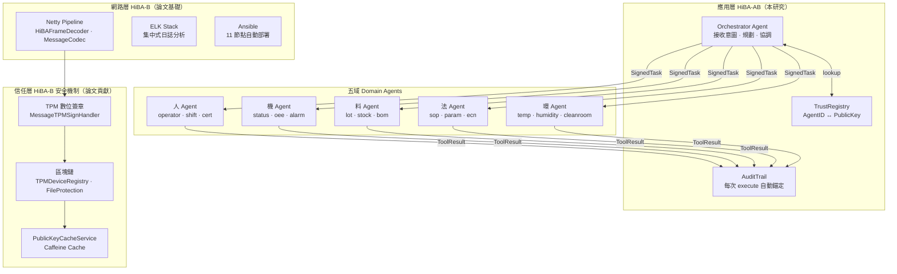

### 2.2 三個公理

#### A1：工具同構公理（Tool Isomorphism Axiom）

```
∀ a ∈ Agent : a ⊆ Tool
─────────────────────────────────────────────
即：任意 Agent 皆滿足 Tool 的完整介面定義
∃ handler, inputSchema, outputSchema, permissions

推論：AgentRegistry ≡ Toolbox
```

此公理使 Agent 與 Tool 共用同一套操作介面。導入新 DomainAgent 只需一行 `registry.register()`，Orchestrator 程式碼零修改。

#### A2：權限遞減公理（Permission Monotonicity Axiom）

```
∀ parent, child ∈ Agent, depth(child) > depth(parent) :
  permissions(child) ⊆ permissions(parent)
─────────────────────────────────────────────────────
即：子層 Agent 的權限集合為父層的子集，不可擴大
```

權限在型別系統層面由 Scoped Toolbox 強制執行，不依賴 runtime 額外檢查，對應 STRIDE 框架中權限提升攻擊的防護。

#### A3：資源決策公理（Resource Decision Axiom）

```
∀ step ∈ PlanStep, node n :
  action(step, n) ∈ { install, update, execute, dispatch }
  where:
    ¬toolbox.has(step.target) ∧ canInstall(n)  → install
    toolbox.has(step.target)  ∧ isStale(n)      → update
    toolbox.has(step.target)  ∧ isCurrent(n)    → execute
    ¬toolbox.has(step.target) ∧ ¬canInstall(n)  → dispatch
─────────────────────────────────────────────────────────
此決策函式為全函式：任意狀態組合均有對應動作
```

節點沒有「不知道該做什麼」的狀態。最壞情況為 dispatch，任務向上委派而非靜默失敗。這是 HiBA-B 原生的繞由機制所沒有的資源決策能力。

### 2.3 三個定理

| 定理 | 內容摘要 | 意義 |
|-----|---------|------|
| T1 有限遞迴終止 | 任意任務在 maxDepth 內必然終止 | 防止工具達到 depth 上限就抓持 MAX_DEPTH_EXCEEDED |
| T2 稽核完整性 | 每次 execute 必然產生唯一 AuditTrail 錨點 | 任何繞過 Toolbox.execute() 的直接 handler 呼叫不在信任範圍內 |
| T3 自然語言決策等價 | plan() 的輸出在執行語意上等價於結構化 ExecutionPlan | LLM 的決策被限制在合法動作集合內，無法產生架構外的行為 |

---

## 三、與舊架構的系統性比較

HiBA-B（Hierarchical **Brokering** Architecture，如碩士論文所提出）與 HiBA-AB 不是替代關係，而是垂直疊加關係。

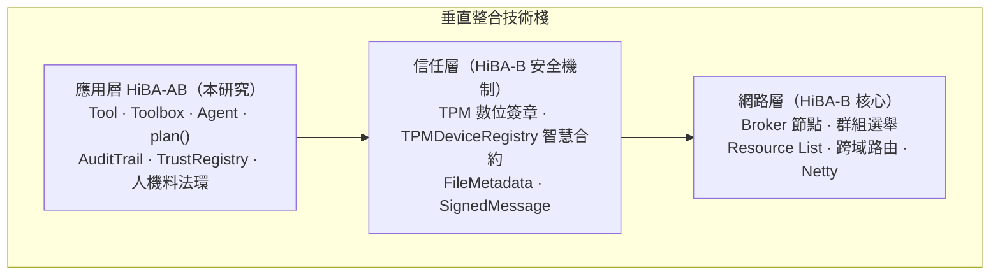

### 3.1 十一維度對比

| 比較維度 | HiBA-B（舊架構） | HiBA-AB（新架構） |
|---------|----------------|----------------|
| 縮寫展開 | Hierarchical **Brokering** Architecture | Hierarchical **Agent Based** Architecture |
| 層次定位 | 網路層（SDN 控制平面延伸） | 應用層（軟體代理委派框架） |
| 核心單元 | Broker 節點（路由器角色，無型別定義） | Tool（原子操作），Agent extends Tool（遞迴可組合） |
| 資源表示 | Resource List（鍵值字串清單，無型別） | inputSchema + outputSchema（JSON Schema，前端可自動渲染） |
| 請求格式 | HiBA Request Template（固定模板） | Task.intent（自然語言）+ parameters（型別化） |
| **資源缺失時** | 往上層 Broker 轉發，最終回傳錯誤碼 | **plan() 推理：安裝 / 更新 / 執行 / 發派（四選一）** |
| 身份驗證 | TPM EK Fingerprint + 區塊鏈（硬體層） | AgentIdentity + SignedTask + TrustRegistry（應用層） |
| 資料完整性 | FileMetadata（針對特定檔案，手動呼叫） | **AuditTrail 自動錨定每個 ToolResult（全面覆蓋）** |
| 權限模型 | 節點有資源清單項目即可存取 | Scoped Toolbox + permissions ⊆ parent（型別強制） |
| 決策機制 | 靜態規則路由（新增規則需改程式碼） | plan() 可插拔介面（規則 / LLM / 混合，切換不改型別） |
| 失敗處理 | 回傳錯誤碼，上層決定 | SupervisionStrategy（fail-fast / retry / fallback / partial） |

---

## 四、六項具體創新點

### I1：Agent IS a Tool — 遞迴組合性

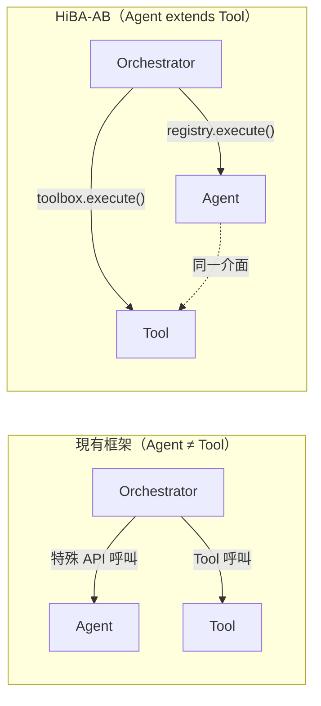

**可量測驗證**：新增第四個 BranchAgent，HiBA-AB = 0 行 Orchestrator 修改；其他框架 = 數十行 diff。

### I2：型別強制的權限遞減不變式

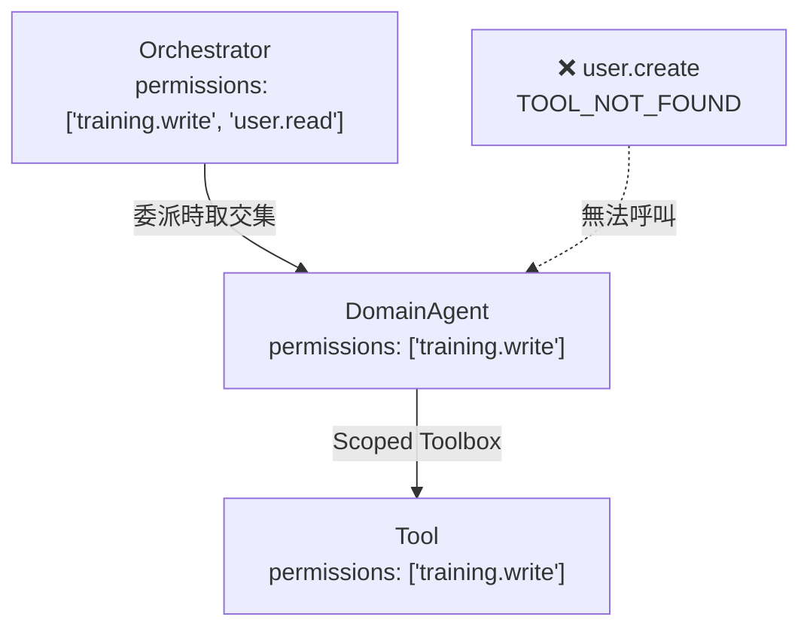

**可量測驗證**：越界呼叫 100% 被 Toolbox 攔截，無需任何 middleware。

### I3：ToolResult 自動錨定（FileMetadata 推廣到應用層）

舊機制針對特定檔案資源手動呼叫。HiBA-AB 讓每個 Tool 執行結果都自動計算雜湊錨點，不需要額外程式碼。

**可量測驗證**：投毒攻擊偵測率 100%，攔截在聚合前，AuditProof 精確定位到 stepId。

### I4：plan() 可插拔介面

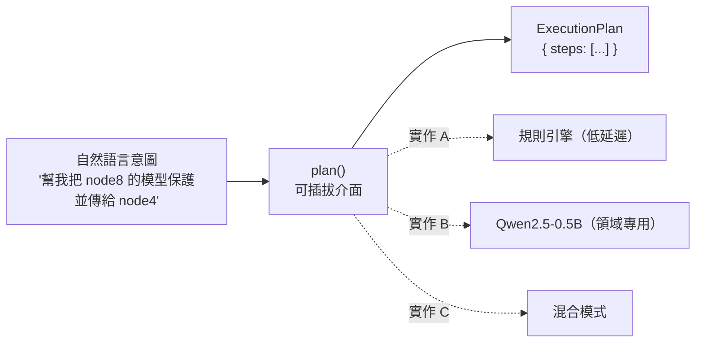

新增業務規則：HiBA-AB = 修改 system prompt（個位數字元）；規則引擎 = 修改程式碼（數十行 diff）。

### I5：自然語言資源決策（安裝 / 委派 / 拒絕）

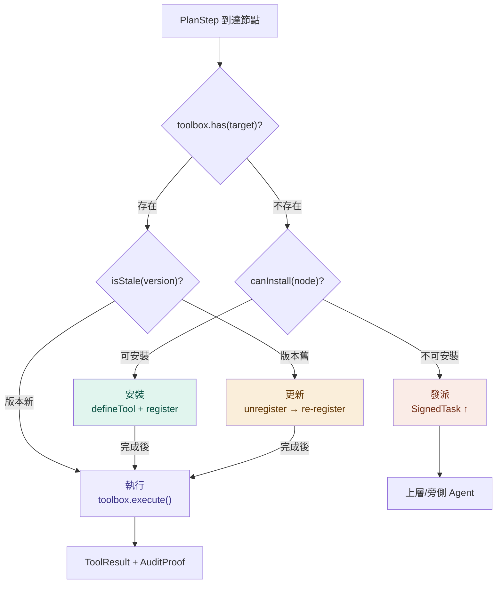

**可量測驗證**：20 個情境決策正確率（vs 人工標注）；資源缺失時任務完成率（HiBA-AB vs 論文規則路由 ≈ 0%）。

### I6：軟硬體雙軌 AgentIdentity

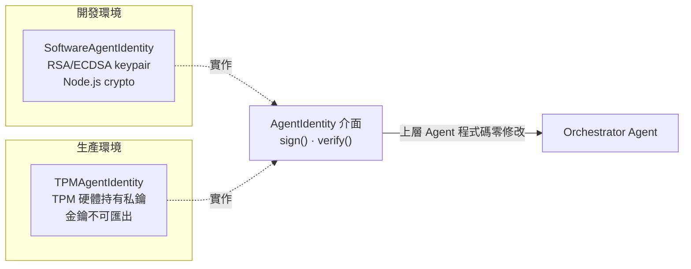

**可量測驗證**：切換 `SoftwareAgentIdentity` → `TPMAgentIdentity`：上層 Agent 程式碼修改行數 = 0。

---

## 五、系統架構說明

### 5.1 現有 hiba-core 與 HiBA-AB 的層級關係

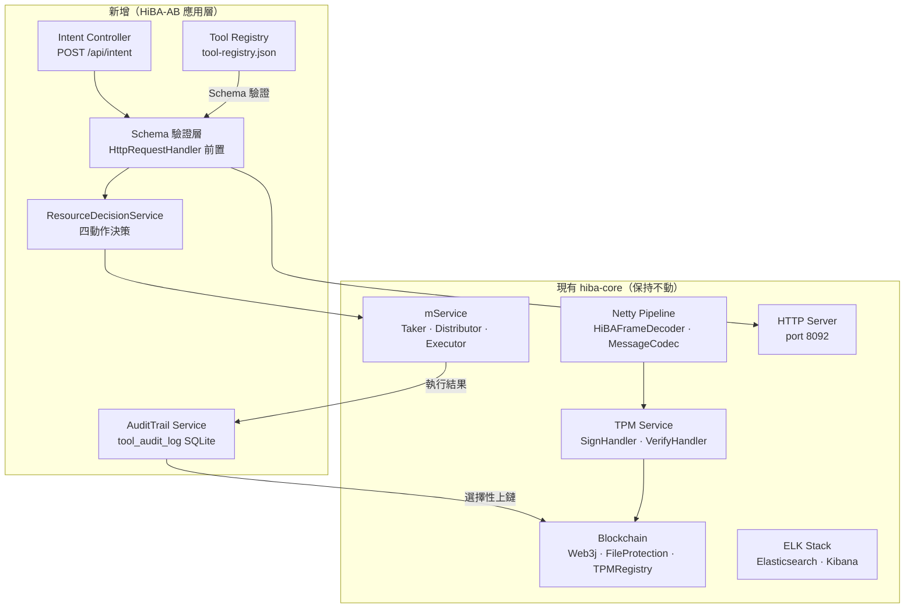

### 5.2 任務委派完整流程

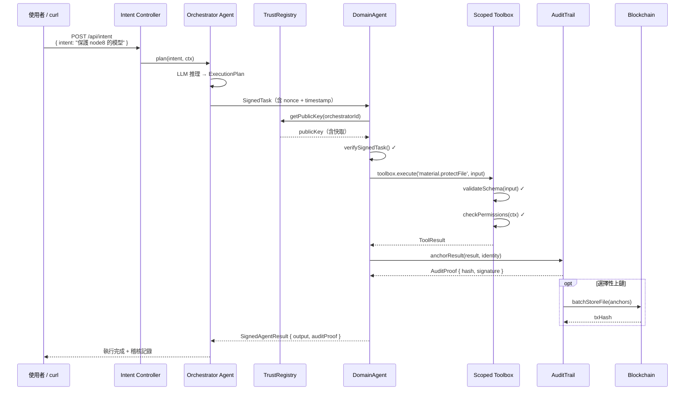

### 5.3 工廠人機料法環 Domain Agents

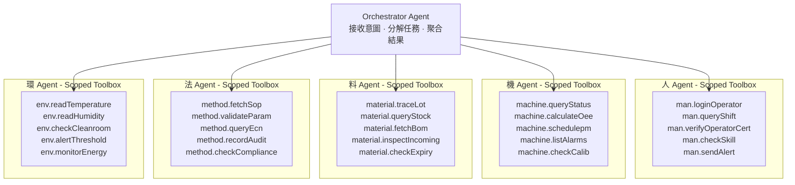

**跨域協作範例**：「機台 CNC-03 換刀後，驗證資格、檢查刀具、確認 SOP、記錄環境」→ 四個 Domain Agent 並行執行，AuditTrail 自動記錄完整稽核鏈。

---

## 六、驗證方案

### 6.1 可量測的六項主張

| # | 主張 | 實驗設計 | 預期結果 |
|---|-----|---------|---------|
| C1 | 遞迴組合性：新增 Agent 不改 Orchestrator | 新增第四個 BranchAgent，量測修改的程式碼行數 | HiBA-AB = 0 行，其他框架 = N 行 |
| C2 | 投毒攻擊偵測：AuditTrail 在聚合前檢測 | 竄改 Node 8 回傳的模型權重 1%/5%/10% | 偵測率 100%，攔截位置為聚合前 |
| C3 | 委派身份驗證：偽造 Orchestrator 被拒絕 | 用不同 keypair 發出 SignedTask，記錄錯誤碼 | 正確回傳 AGENT_NOT_REGISTERED |
| C4 | 權限隔離：TrainingAgent 無法越界 | 對 TrainingAgent Toolbox 呼叫 user.create | 回傳 TOOL_NOT_FOUND，無需 runtime 檢查 |
| C5 | 監督策略：單節點離線不影響整體 | 關閉 Node 9，比較 fail-fast vs partial-success | partial-success 模式可成功回傳 4/5 結果 |
| C6 | 自然語言決策：資源缺失時判斷安裝/委派/拒絕 | 20 個情境人工標注，與 plan() 輸出比較正確率 | 預期超過 80%，舊架構決策正確率 ≈ 0% |

### 6.2 分支樹投毒實驗設計（C2 最有說服力）

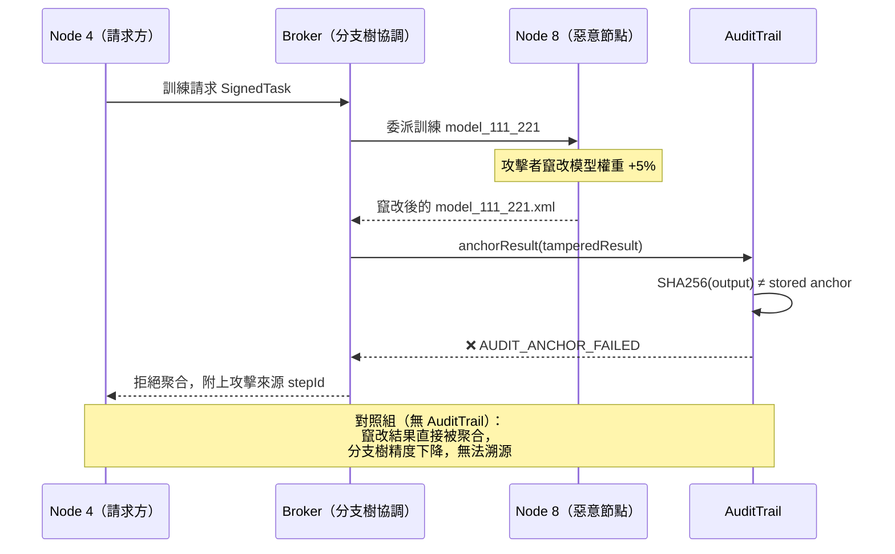

---

## 七、自訓練 plan() 模型的可行性

HiBA-AB 的 `plan()` 介面定義了「意圖到執行計畫的翻譯器」，不必依賴外部 LLM API。就工廠環境最重要的安全性考量——生產資料不可送往外部服務——自訓練領域專用小模型具有明顯優勢。

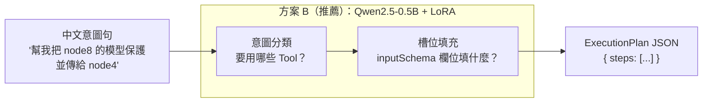

### 三種方案比較

| 方案 | 模型 | 參數量 | 中文理解 | 訓練難度 | 論文差異化 |
|-----|------|--------|---------|---------|----------|
| A | mT5-small | 300M | 普通 | 低，2-4 小時 | 輸出格式可控，天然適合 text-to-JSON |
| **B（推薦）** | **Qwen2.5-0.5B** | **500M** | **好** | **低，LoRA 微調 4-8 小時** | **中文最強小模型，指令微調新成熟** |
| C | 雙模型串聯（BERT + T5） | ~200M × 2 | 好 | 中 | 子任務可分別評估，最高精確率，論文可解釋性最強 |

訓練資料由 `tool-registry.json` 中的 Tool 定義自動合成（節點名稱 × 檔案名稱 × 意圖範本），約 2000–5000 筆即可，不需大量人工標注。

---

## 八、商業化可行性

### 8.1 三大商業化路徑

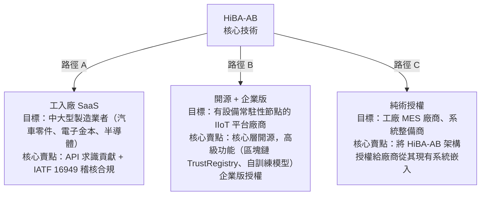

### 8.2 差異化優勢

與商業競等品的差異化在於三點：

1. **安全性先天設計**。現有 AI 工具組合安全性多為事後附加，HiBA-AB 的 AuditTrail、SignedTask、TrustRegistry 是架構的結構性保障而非選項功能，建立在已實證的 TPM + 區塊鏈基礎上。

2. **小型金鑰領域專用模型**。自訓練的 `plan()` 模型資料不離開工廠，滿足工業安全規範。對廠商而言此為重要購買理由。

3. **橫向連接現有生態系統**。Toolbox 的 `toMCPServer()` 輸出可讓 HiBA-AB 管理的工具被 Claude、Copilot 等外部 AI 助理直接呼叫，形成連接器生意。

### 8.3 市場時機

全球工業 AI 市場在 2024–2030 間預計年複合成長率超過 28%（MarketsandMarkets 2024 報告）。推動力主要來自兩點：IATF 16949 第三版從 2026 年起將加密實施對數位化驗證的要求，直接大幅提升對「可稽核 AI 驗證記錄」的市場需求；AI 代理區塊鏈安全通透工業場景更鄰，針對此議題尤為稀缺的解決方案。

---

## 九、目前進度與後續計畫

### 9.1 已完成項目

- [x] hiba-core 的完整 Java 實作（Netty、TPM、區塊鏈、ELK 日誌）
- [x] L0–L6 六層 TypeScript 型別定義（696 行，strict mode 零錯誤）
- [x] 五套件 Monorepo 架構規劃與套件依賴圖
- [x] 人機料法環 Domain Agent 設計
- [x] 六項創新點整理與形式化理論（三公理 + 三定理）
- [x] Tool / Toolbox 命名規範與 Schema 規則
- [x] C1–C6 可驗證主張設計與預期結果預測矩陣
- [x] hiba-core 新功能分析（ToolRegistry、Schema 驗證層、traceId 傳播、四動作決策、AuditTrail 細化、Intent Controller）

### 9.2 後續六個月計畫

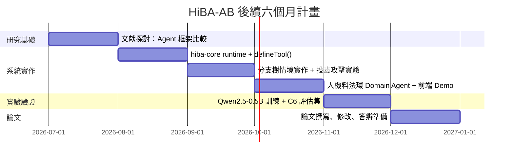


