# 階層式智慧代理架構與工具微服務架構的融合設計
## HiBA-AB：Hierarchical Agent Based Architecture
### 結合 TPM 硬體信任、區塊鏈稽核與自然語言自主決策

> **文件版本**：v2.0（2026-03）

> **修訂摘要**：新增部署架構決策（進程分離策略）、前端基礎設施設計、詳細五階段待辦清單

---

## 一、研究背景與動機

### 1.1 問題界定

現有分散式 AI 代理框架面臨三項未解決的核心問題：

**第一個問題是「組合間隙（Coupling）」。** 現有框架（LangGraph、AutoGen、CrewAI）將 Agent 與 Tool 視為異質型別，導致新增代理時必須修改頂層管理邏輯。

**第二個問題是「資源缺失時的行為未定義」。** 當節點沒有對應資源時，現有架構僅能回傳錯誤碼要求人工介入，無法自主判斷。

**第三個問題是「AI 行為的可稽核性不足」。** 多數框架缺乏結構化的執行記錄，導致 AI 代理做了什麼難以事後稽核。

整備式工廠環境對上述三項問題尤為敏感：運總工作攬包必須符合 IATF 16949 與 ISO 27001，每一個操作都需要完整稽核蹤跡；生產線差異時今需快速對應而不能一直等人工提單。

### 1.2 研究關鍵問題

| # | 問題陳述 | 對應公理 |
|---|---------|--------|
| RQ1 | 是否存在一種同構型別系統，使 Agent 與 Tool 在呼叫端完全等價？ | A1 工具同構公理 |
| RQ2 | 節點資源缺失時，能否在架構層定義完備的自主決策函式？ | A3 資源決策公理 |
| RQ3 | 能否讓每次 AI 代理執行都自動產生可驗證的完整稽核記錄？ | A2 權限遞減 + T2 |

---

## 二、核心理論框架

### 2.1 整體架構觀

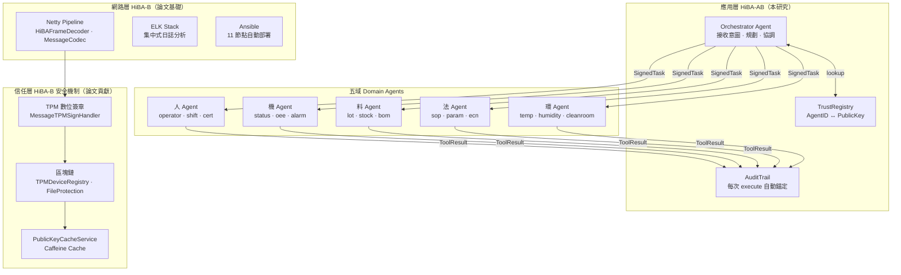

### 2.2 三個公理

#### A1：工具同構公理（Tool Isomorphism Axiom）

```
∀ a ∈ Agent : a ⊆ Tool
─────────────────────────────────────────────
即：任意 Agent 皆滿足 Tool 的完整介面定義
∃ handler, inputSchema, outputSchema, permissions

推論：AgentRegistry ≡ Toolbox
```

此公理使 Agent 與 Tool 共用同一套操作介面。導入新 DomainAgent 只需一行 `registry.register()`，Orchestrator 程式碼零修改。

#### A2：權限遞減公理（Permission Monotonicity Axiom）

```
∀ parent, child ∈ Agent, depth(child) > depth(parent) :
  permissions(child) ⊆ permissions(parent)
─────────────────────────────────────────────────────
即：子層 Agent 的權限集合為父層的子集，不可擴大
```

權限在型別系統層面由 Scoped Toolbox 強制執行，不依賴 runtime 額外檢查，對應 STRIDE 框架中權限提升攻擊的防護。

#### A3：資源決策公理（Resource Decision Axiom）

```
∀ step ∈ PlanStep, node n :
  action(step, n) ∈ { install, update, execute, dispatch }
  where:
    ¬toolbox.has(step.target) ∧ canInstall(n)  → install
    toolbox.has(step.target)  ∧ isStale(n)      → update
    toolbox.has(step.target)  ∧ isCurrent(n)    → execute
    ¬toolbox.has(step.target) ∧ ¬canInstall(n)  → dispatch
─────────────────────────────────────────────────────────
此決策函式為全函式：任意狀態組合均有對應動作
```

節點沒有「不知道該做什麼」的狀態。最壞情況為 dispatch，任務向上委派而非靜默失敗。這是 HiBA-B 原生的繞由機制所沒有的資源決策能力。

### 2.3 三個定理

| 定理 | 內容摘要 | 意義 |
|-----|---------|------|
| T1 有限遞迴終止 | 任意任務在 maxDepth 內必然終止 | 防止工具達到 depth 上限就拋出 MAX_DEPTH_EXCEEDED |
| T2 稽核完整性 | 每次 execute 必然產生唯一 AuditTrail 錨點 | 任何繞過 Toolbox.execute() 的直接 handler 呼叫不在信任範圍內 |
| T3 自然語言決策等價 | plan() 的輸出在執行語意上等價於結構化 ExecutionPlan | LLM 的決策被限制在合法動作集合內，無法產生架構外的行為 |

---

## 三、與舊架構的系統性比較

HiBA-B（Hierarchical **Brokering** Architecture，如碩士論文所提出）與 HiBA-AB 不是替代關係，而是垂直疊加關係。

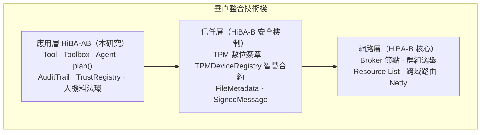

### 3.1 十一維度對比

| 比較維度 | HiBA-B（舊架構） | HiBA-AB（新架構） |
|---------|----------------|----------------|
| 縮寫展開 | Hierarchical **Brokering** Architecture | Hierarchical **Agent Based** Architecture |
| 層次定位 | 網路層（SDN 控制平面延伸） | 應用層（軟體代理委派框架） |
| 核心單元 | Broker 節點（路由器角色，無型別定義） | Tool（原子操作），Agent extends Tool（遞迴可組合） |
| 資源表示 | Resource List（鍵值字串清單，無型別） | inputSchema + outputSchema（JSON Schema，前端可自動渲染） |
| 請求格式 | HiBA Request Template（固定模板） | Task.intent（自然語言）+ parameters（型別化） |
| **資源缺失時** | 往上層 Broker 轉發，最終回傳錯誤碼 | **plan() 推理：安裝 / 更新 / 執行 / 發派（四選一）** |
| 身份驗證 | TPM EK Fingerprint + 區塊鏈（硬體層） | AgentIdentity + SignedTask + TrustRegistry（應用層） |
| 資料完整性 | FileMetadata（針對特定檔案，手動呼叫） | **AuditTrail 自動錨定每個 ToolResult（全面覆蓋）** |
| 權限模型 | 節點有資源清單項目即可存取 | Scoped Toolbox + permissions ⊆ parent（型別強制） |
| 決策機制 | 靜態規則路由（新增規則需改程式碼） | plan() 可插拔介面（規則 / LLM / 混合，切換不改型別） |
| 失敗處理 | 回傳錯誤碼，上層決定 | SupervisionStrategy（fail-fast / retry / fallback / partial） |

---

## 四、六項具體創新點

### I1：Agent IS a Tool — 遞迴組合性

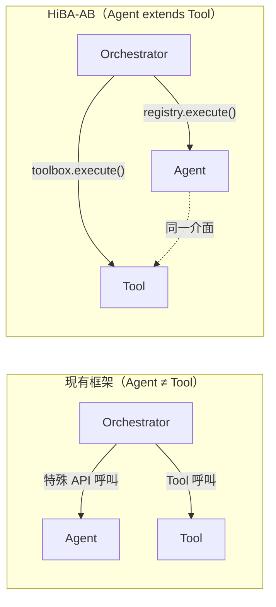

**可量測驗證**：新增第四個 BranchAgent，HiBA-AB = 0 行 Orchestrator 修改；其他框架 = 數十行 diff。

### I2：型別強制的權限遞減不變式

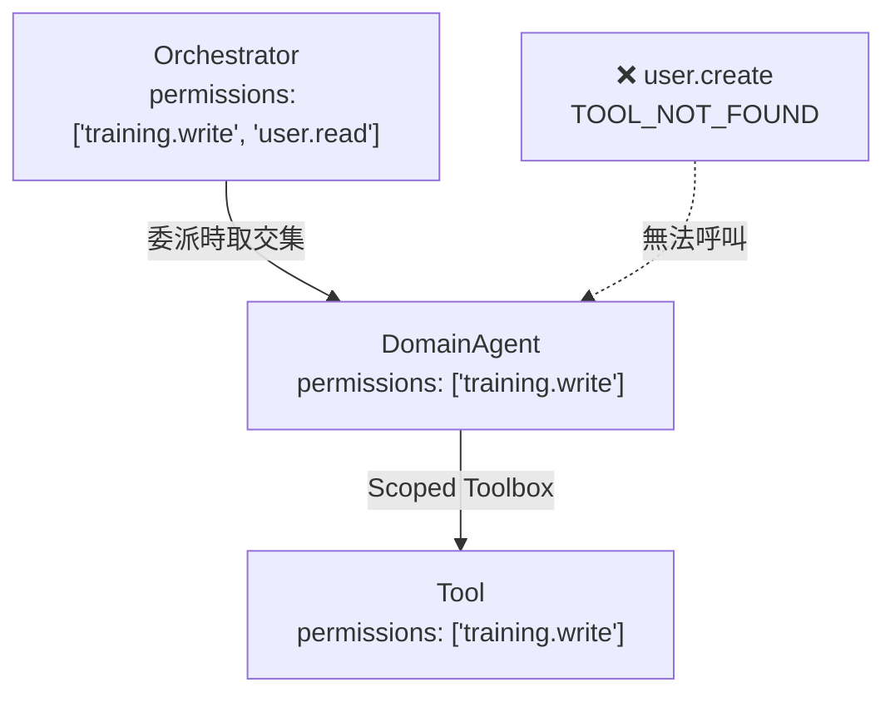

**可量測驗證**：越界呼叫 100% 被 Toolbox 攔截，無需任何 middleware。

### I3：ToolResult 自動錨定（FileMetadata 推廣到應用層）

舊機制針對特定檔案資源手動呼叫。HiBA-AB 讓每個 Tool 執行結果都自動計算雜湊錨點，不需要額外程式碼。

**可量測驗證**：投毒攻擊偵測率 100%，攔截在聚合前，AuditProof 精確定位到 stepId。

### I4：plan() 可插拔介面

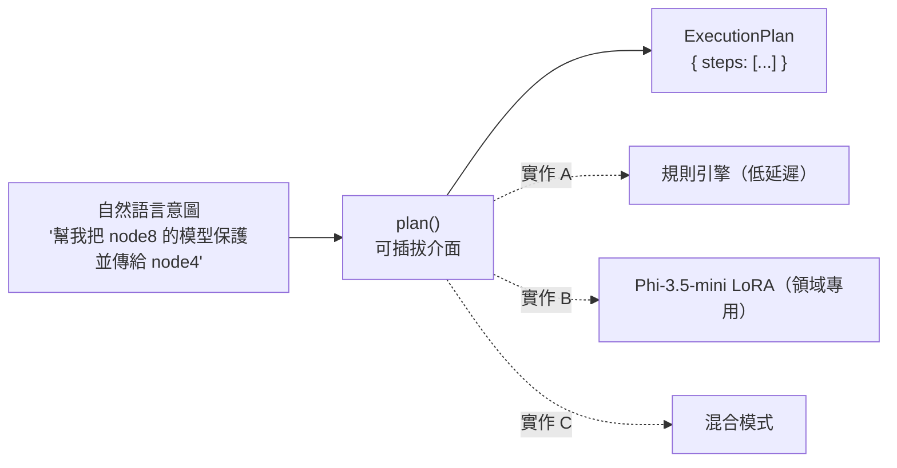

新增業務規則：HiBA-AB = 修改 system prompt（個位數字元）；規則引擎 = 修改程式碼（數十行 diff）。

### I5：自然語言資源決策（安裝 / 委派 / 拒絕）

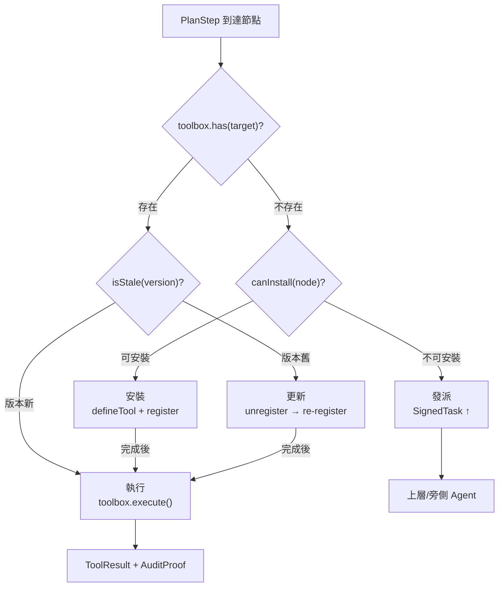

**可量測驗證**：20 個情境決策正確率（vs 人工標注）；資源缺失時任務完成率（HiBA-AB vs 論文規則路由 ≈ 0%）。

### I6：軟硬體雙軌 AgentIdentity

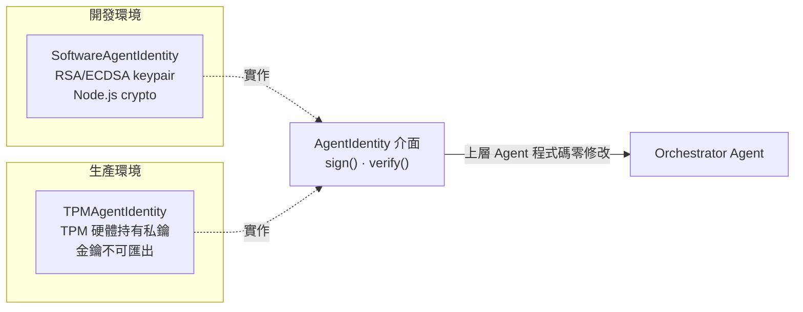

**可量測驗證**：切換 `SoftwareAgentIdentity` → `TPMAgentIdentity`：上層 Agent 程式碼修改行數 = 0。

---

## 五、系統架構說明

### 5.1 現有 hiba-core 與 HiBA-AB 的層級關係

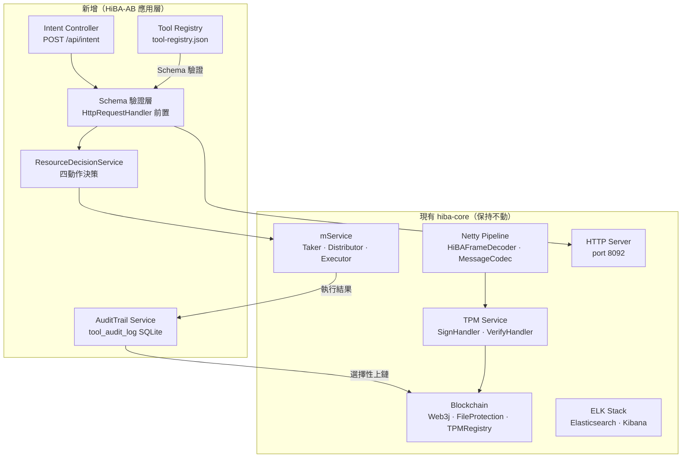

### 5.2 任務委派完整流程

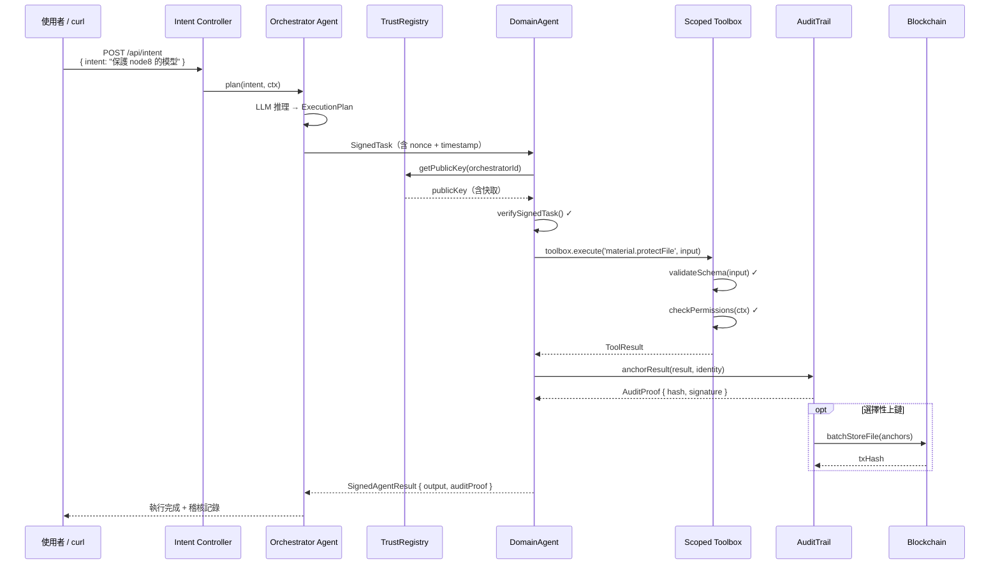

### 5.3 工廠人機料法環 Domain Agents

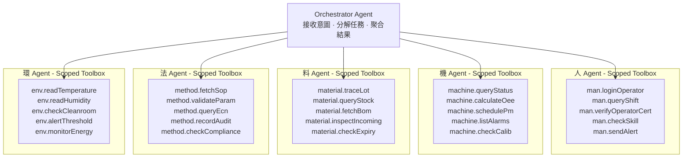

**跨域協作範例**：「機台 CNC-03 換刀後，驗證資格、檢查刀具、確認 SOP、記錄環境」→ 四個 Domain Agent 並行執行，AuditTrail 自動記錄完整稽核鏈。

---

## 六、驗證方案

### 6.1 可量測的六項主張

| # | 主張 | 實驗設計 | 預期結果 |
|---|-----|---------|---------|
| C1 | 遞迴組合性：新增 Agent 不改 Orchestrator | 新增第四個 BranchAgent，量測修改的程式碼行數 | HiBA-AB = 0 行，其他框架 = N 行 |
| C2 | 投毒攻擊偵測：AuditTrail 在聚合前檢測 | 竄改 Node 8 回傳的模型權重 1%/5%/10% | 偵測率 100%，攔截位置為聚合前 |
| C3 | 委派身份驗證：偽造 Orchestrator 被拒絕 | 用不同 keypair 發出 SignedTask，記錄錯誤碼 | 正確回傳 AGENT_NOT_REGISTERED |
| C4 | 權限隔離：TrainingAgent 無法越界 | 對 TrainingAgent Toolbox 呼叫 user.create | 回傳 TOOL_NOT_FOUND，無需 runtime 檢查 |
| C5 | 監督策略：單節點離線不影響整體 | 關閉 Node 9，比較 fail-fast vs partial-success | partial-success 模式可成功回傳 4/5 結果 |
| C6 | 自然語言決策：資源缺失時判斷安裝/委派/拒絕 | 20 個情境人工標注，與 plan() 輸出比較正確率 | 預期超過 80%，舊架構決策正確率 ≈ 0% |

### 6.2 分支樹投毒實驗設計（C2 最有說服力）

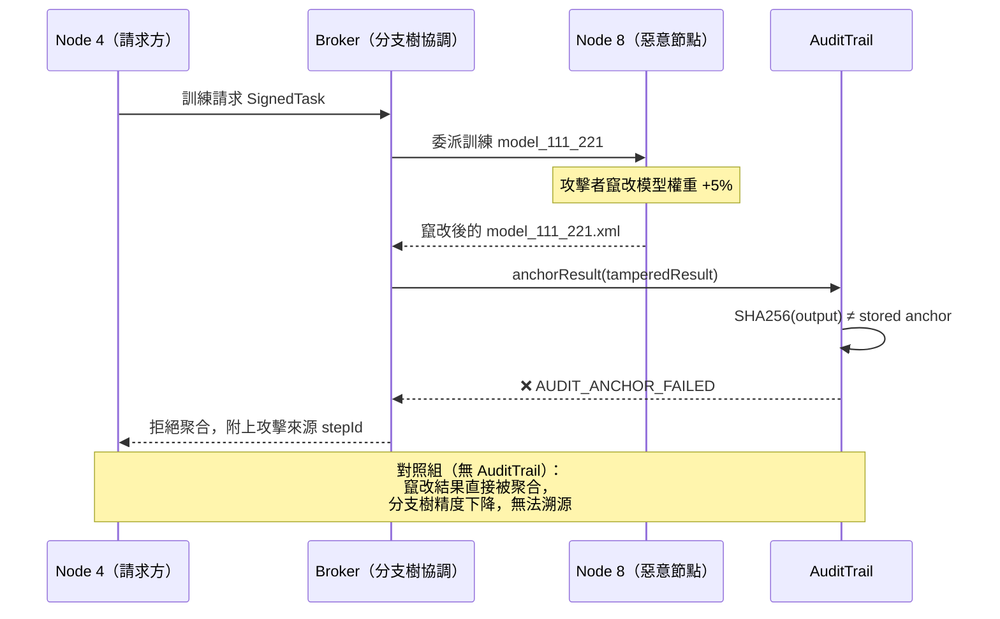

---

## 七、自訓練 plan() 模型的可行性

HiBA-AB 的 `plan()` 介面定義了「意圖到執行計畫的翻譯器」，不必依賴外部 LLM API。就工廠環境最重要的安全性考量——生產資料不可送往外部服務——自訓練領域專用小模型具有明顯優勢。

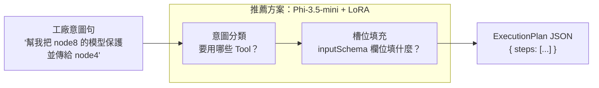

### 三種方案比較

| 方案 | 模型 | 參數量 | 訓練難度 | 論文差異化 | 備注 |
|-----|------|--------|---------|----------|------|
| **A（推薦）** | **Phi-3.5-mini（Microsoft）** | **3.8B** | **中，LoRA 微調 4-8 小時** | **多語言能力強，指令遵循成熟，符合無中國廠商模型要求** | 首選 |
| B（備用） | Llama 3.2 3B（Meta） | 3B | 中，LoRA 微調 4-6 小時 | Meta 開源模型，社群活躍 | Phi 不可用時的後備 |
| C | mT5-small | 300M | 低，2-4 小時 | 輸出格式可控，天然適合 text-to-JSON | 驗證概念用 |

> **注意**：不使用 Qwen 系列（阿里雲）或其他中國廠商模型，以符合工廠資安審查要求。

訓練資料由 `tool-registry.json` 中的 Tool 定義自動合成（節點名稱 × 檔案名稱 × 意圖範本），約 2000–5000 筆即可，不需大量人工標注。

---

## 八、商業化可行性

### 8.1 三大商業化路徑

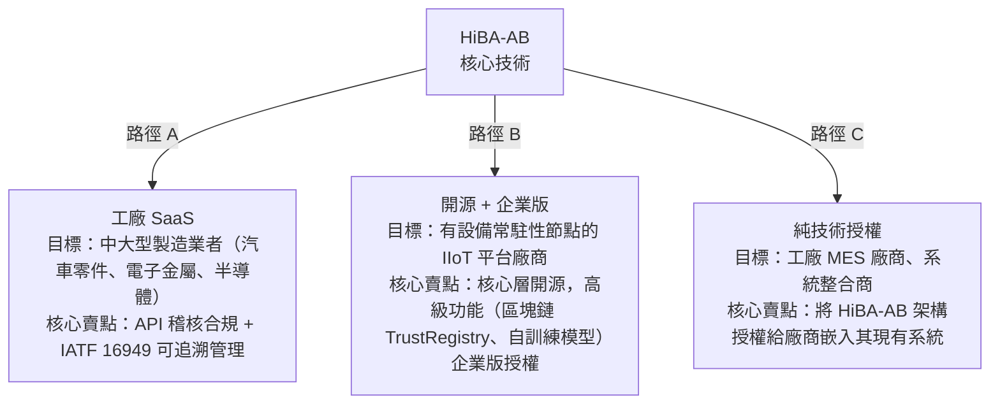

### 8.2 差異化優勢

1. **安全性先天設計**：現有 AI 工具組合安全性多為事後附加，HiBA-AB 的 AuditTrail、SignedTask、TrustRegistry 是架構的結構性保障，建立在已實證的 TPM + 區塊鏈基礎上。

2. **小型領域專用模型**：自訓練的 `plan()` 模型資料不離開工廠，滿足工業安全規範。對廠商而言此為重要購買理由。

3. **橫向連接現有生態系統**：Toolbox 的 `toMCPServer()` 輸出可讓 HiBA-AB 管理的工具被 Claude、Copilot 等外部 AI 助理直接呼叫，形成連接器生意。

### 8.3 市場時機

全球工業 AI 市場在 2024–2030 間預計年複合成長率超過 28%（MarketsandMarkets 2024）。IATF 16949 第三版從 2026 年起將加密實施對數位化驗證的要求，直接提升對「可稽核 AI 驗證記錄」的市場需求。

---

## 九、部署架構決策：HiBA-AB 進程分離策略

### 9.1 分離等級定義

本研究採用**等級 B：獨立進程/容器分離**。HiBA-AB 作為獨立的 Node.js 進程，透過 HTTP REST 與現有 hiba-core（Java）進程通訊，不修改 hiba-core 核心邏輯。

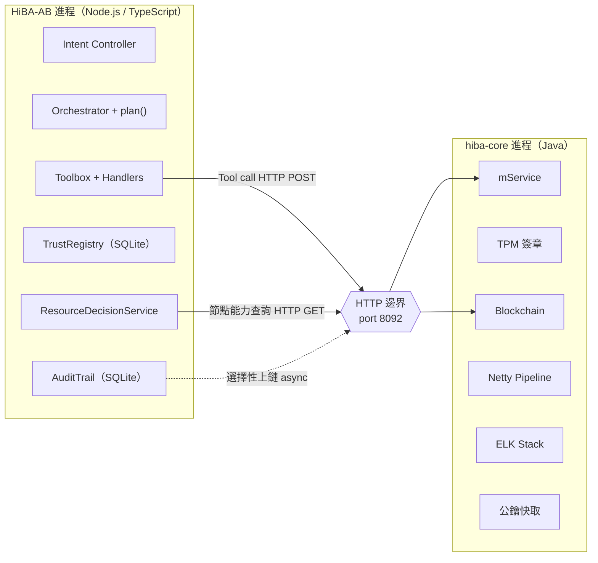

### 9.2 六個整合點分析

| 整合點 | HiBA-AB 需要 | hiba-core 提供 | 可分離性 | 處理方式 |
|--------|------------|--------------|--------|---------|
| Tool handler 執行 | 呼叫 BlockchainFileProtect 等服務 | HTTP port 8092 REST | ✓ 簡單 | 直接 HTTP POST，現有 API 不改動 |
| Agent 身份驗證 | AgentID ↔ PublicKey | TPMDeviceRegistry（硬體層） | ✓ 獨立 | HiBA-AB 自維護應用層 TrustRegistry（SQLite） |
| AuditTrail 本地儲存 | 每次執行的稽核錨點 | —（新功能） | ✓ 完全自主 | SQLite 在 HiBA-AB 進程內，零外部依賴 |
| AuditTrail 選擇性上鏈 | 把 AuditProof hash 寫入區塊鏈 | Web3j + FileProtectionContract | ⚠ 需決策 | 透過 hiba-core 新增 `POST /api/audit/anchor` 代理上鏈 |
| ResourceDecision 節點能力查詢 | canInstall(node)、isStale(version) | Resource List（目前無外露 API）| ⚠ **需新增** | **hiba-core 新增 `GET /api/nodes/capabilities`（唯一需要改動的端點）** |
| Public Key 快取 | 驗證 SignedTask | PublicKeyCacheService（Caffeine） | ✓ 獨立 | HiBA-AB 自帶 in-memory cache，key 來自 TrustRegistry SQLite |

### 9.3 hiba-core 唯一需要新增的端點

```http
GET /api/nodes/capabilities?nodeId={id}
Response: {
  "nodeId": "node-08",
  "tools": [
    { "name": "material.protectFile", "version": "1.0.0" },
    { "name": "material.verifyFile",  "version": "1.0.0" }
  ],
  "canInstall": true
}
```

### 9.4 跨進程的 traceId 傳播規範

所有 HiBA-AB 發出的 HTTP 請求，需在 header 帶上 `X-Trace-Id`，使兩個進程的 ELK 日誌可以在 Kibana 中關聯查詢。

```
X-Trace-Id: {taskId}-{stepId}   // 例如：task-abc123-step-002
X-Agent-Id: {agentId}           // 例如：material-agent-01
X-Depth:    {depth}             // 委派深度，對應 T1 定理
```

### 9.5 身份系統雙軌並存

| 環境 | 身份實作 | 私鑰位置 | 對應 hiba-core |
|-----|---------|---------|--------------|
| 開發 | SoftwareAgentIdentity | Node.js 記憶體 / .env | 無對應（純應用層） |
| 生產 | TPMAgentIdentity | TPM 硬體晶片（不可匯出） | TPMDeviceRegistry 智慧合約 |

切換時，上層 Orchestrator 程式碼零修改（I6 創新點的具體意義）。

---

## 十、前端基礎設施設計

### 10.1 前端的根本依賴：ToolRegistry 先行

根據 schema-as-contract 原則，前端的唯一合約是 `inputSchema` + `outputSchema`。**前端在讀到 ToolRegistry 之前無法渲染任何表單**。因此基礎設施的建立順序如下：

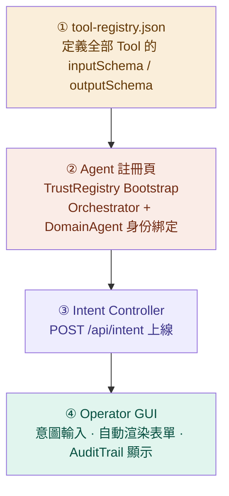

### 10.2 最小可行前端：兩個頁面

#### 頁面 1 — Admin 管理頁（基礎設施層，先做）

**用途**：開發期與部署期的初始化工具，不對終端操作員開放。

| 區塊 | 功能 | 關鍵行為 |
|------|------|---------|
| ToolRegistry 瀏覽器 | 顯示所有 Tool 的 schema、version、tags | 讀 `GET /api/tools`，驗證 defineTool 格式正確 |
| Orchestrator 身份設定 | 輸入 AgentID、選擇 keypair 來源 | 呼叫 `SoftwareAgentIdentity.generate()`，寫入 TrustRegistry |
| Domain Agent 批次註冊 | 五域各一，勾選 permissions | **前端強制 A2：超出父層的選項自動灰化** |
| TPM 橋接（選用） | 輸入 EK Fingerprint，綁定硬體身份 | 對應 I6 切換點 |
| 連線狀態 Dashboard | hiba-core port 8092、區塊鏈節點 | 綠燈 = 系統就緒 |
| SignedTask 測試 | 送出 test task，驗 C3 主張 | 預期回傳 200 OK，非 AGENT_NOT_REGISTERED |

#### 頁面 2 — Operator 操作頁（Demo 層，論文展示主體）

**用途**：實際工廠操作員使用介面，也是論文 Demo 的主要畫面。

| 區塊 | 功能 | 關鍵行為 |
|------|------|---------|
| 意圖輸入框 | 自然語言輸入，支援中文 | POST /api/intent，觸發 plan() |
| Tool 選擇器 | 從 ToolRegistry 動態渲染，按五域分組 | 手動指定 Tool（繞過 plan()） |
| 參數表單 | 依據 `inputSchema` 自動渲染欄位 | `ui:widget` hint 決定控制元件類型 |
| ExecutionPlan 視覺化 | 樹狀顯示每個 PlanStep 的狀態 | 灰→黃→綠/紅，即時更新 |
| AuditTrail 時間軸 | 每次 execute 的 hash 錨點與 txHash | 點擊可展開完整 AuditProof |
| 錯誤處理面板 | TOOL_NOT_FOUND / AGENT_NOT_REGISTERED 等錯誤碼 | 對應錯誤碼對照表，給出明確說明 |

### 10.3 前端與實作階段的對應關係

| 實作階段完成 | 解鎖的前端功能 |
|------------|-------------|
| 第一階段：型別確認 | Admin 頁 ToolRegistry 瀏覽器（讀靜態 JSON，不需後端） |
| 第二階段：Runtime | Admin 頁 Agent 註冊表單（TrustRegistry API 接通） |
| 第三階段：Tool 清單 | Operator 頁參數表單自動渲染（全部 19 個 Tool 有 schema） |
| 第四階段：API 層 | Operator 頁完整流程（/api/intent 上線） |
| 第五階段：plan() | Operator 頁自然語言輸入真正有效（LLM 推理接通） |

---

## 十一、目前進度與後續計畫

### 11.1 已完成項目

**理論層面**
- [x] HiBA-AB 核心理論：三個公理（A1/A2/A3）+ 三個定理（T1/T2/T3）
- [x] 與 HiBA-B 的十一維度系統性比較
- [x] 六項創新點（I1–I6）的完整論述與可量測驗證方式
- [x] C1–C6 六項可驗證主張與實驗設計

**規格層面**
- [x] `hiba.types.ts`：L0–L6 六層 TypeScript 型別定義，696 行，strict mode 零錯誤
- [x] Tool 命名規範：`{domain}.{verbObject}` 格式、verb 白名單
- [x] inputSchema / outputSchema 規則（含 `ui:widget` hint）
- [x] 錯誤碼對照表與 retryPolicy 規則
- [x] 五套件 Monorepo 架構規劃（hiba-core / hiba-trust / hiba-agent / hiba-adapters / hiba-blockchain）

**架構決策**
- [x] HiBA-AB 進程分離策略（等級 B：獨立 Node.js 進程，HTTP 通訊）
- [x] 六個整合點分析與對應方案
- [x] 前端基礎設施設計（Admin 頁 + Operator 頁最小可行版本）
- [x] plan() LLM 選型：Phi-3.5-mini（Microsoft，3.8B）為主，Llama 3.2 3B 為備

**文件層面**
- [x] 研究構想說明書 v1（.docx + .md，含九張 Mermaid 架構圖）
- [x] 新舊 HiBA 對話總結互動式圖表
- [x] 商業化可行性分析（三條路徑）
- [x] 後續六個月時程規劃

**現有程式碼（hiba-core）**
- [x] Java 21 + Netty 網路層（完整）
- [x] TPM 數位簽章四階段驗證（完整）
- [x] 區塊鏈整合：FileProtectionContract + TPMDeviceRegistry（完整）
- [x] ELK 日誌分析環境（完整）
- [x] Ansible 11 節點自動部署（完整）

---

### 11.2 五階段詳細待辦清單

---

#### 第一階段：型別確認與規則（估計 2 週）

**目標**：確認所有介面欄位，使後續實作不需回頭修改型別定義。

**1.1 ToolContext 補齊**
- [ ] 在 `ToolContext` 加入 `hibaBaseUrl: string`（所有 handler 透過此 URL 呼叫 hiba-core，禁止硬編碼）
- [ ] 確認 `traceId: string`、`depth: number` 欄位存在（對應跨進程 traceId 傳播規範）
- [ ] 確認 `agentId: string` 欄位存在（對應 ELK `X-Agent-Id` header）

**1.2 AuditTrail 型別**
- [ ] 定義 `AuditRecord` 介面：`{ traceId, stepId, toolName, inputHash, outputHash, timestamp, agentId, auditProofHash, txHash? }`
- [ ] 確認 `AuditProof` 與 `SignedAgentResult` 的嵌套關係符合 T2 定理（每次 execute 必有唯一錨點）

**1.3 ResourceDecision 型別**
- [ ] 定義 `NodeCapability` 介面：`{ nodeId, tools: ToolRef[], canInstall: boolean }`
- [ ] 定義 `ResourceAction` 聯集型別：`'install' | 'update' | 'execute' | 'dispatch'`（對應 A3）

**1.4 前端 schema hint 補齊**
- [ ] 確認 `inputSchema` 的每個欄位都有 `.describe()` 字串（前端 tooltip 來源）
- [ ] 在需要特殊控制元件的欄位加入 `.meta({ 'ui:widget': '...' })` hint
  - `'status-light'`：布林值燈號顯示
  - `'file-path'`：路徑選擇器
  - `'node-selector'`：節點下拉選單
  - `'datetime'`：日期時間選擇器

**1.5 驗證方式**
- [ ] `npx tsc --noEmit` 零錯誤
- [ ] 手動 review 每個 `ToolContext` 欄位是否在 handler 內有對應使用

---

#### 第二階段：Runtime 實作（估計 3–4 週）

**目標**：讓 `defineTool()` + `HiBAToolbox` + `TrustRegistry` 可以在 Node.js 環境中實際運行。

**2.1 `defineTool()` 函式**
- [ ] 實作 `defineTool(config: ToolDefinition): RegisteredTool`
- [ ] 內部執行：zod schema 驗證 → permissions 格式檢查 → retryPolicy 預設值填充
- [ ] 型別檢查：確保 `tags[0]` 必須是合法 domain、`tags[1]` 必須是 `'read' | 'write'`
- [ ] 單元測試：傳入合法 / 非法 config，驗證回傳值與錯誤訊息

**2.2 `HiBAToolbox` 類別**
- [ ] 實作 `register(tool: RegisteredTool): void`（A1 同構公理的實體）
- [ ] 實作 `execute(name, input, ctx): Promise<ToolResult>`
  - 內部流程：`validateSchema(input)` → `checkPermissions(ctx)` → `handler(input, ctx)` → `anchorResult(result)`
  - 任何步驟失敗都必須產生 AuditRecord（T2 定理：失敗也要有記錄）
- [ ] 實作 `has(toolName): boolean`（供 ResourceDecisionService 使用）
- [ ] 實作 `ScopedToolbox.fromParent(parent, permissions)`（A2 權限遞減的執行點）
- [ ] 單元測試：C4 場景 — 越界呼叫必須回傳 `TOOL_NOT_FOUND`

**2.3 `NodeCapabilityChecker`**
- [ ] 實作 `canInstall(nodeId): Promise<boolean>`（HTTP GET /api/nodes/capabilities）
- [ ] 實作 `isStale(nodeId, toolName, version): Promise<boolean>`
- [ ] 加入 retry / timeout 處理（連線 hiba-core 失敗時，預設 dispatch 而非 execute）

**2.4 `ResourceDecisionService`**
- [ ] 實作 `decide(step: PlanStep, nodeId: string): Promise<ResourceAction>`
- [ ] 嚴格對應 A3 公理四條件，禁止新增第五條分支
- [ ] 單元測試：四個狀態組合各一個測試案例

**2.5 `TrustRegistry` 服務**
- [ ] SQLite schema：`agents(agentId TEXT PK, publicKeyPem TEXT, role TEXT, permissions TEXT JSON, parentAgentId TEXT, createdAt TEXT)`
- [ ] 實作 CRUD API：`register / getPublicKey / list / revoke`
- [ ] 實作 in-memory LRU 快取（公鑰查詢，TTL 5 分鐘，對應 hiba-core PKC 設計）
- [ ] 對應 I6：`SoftwareAgentIdentity` 與 `TPMAgentIdentity` 共用同一介面

**2.6 `AuditTrail` 服務**
- [ ] SQLite schema：`tool_audit_log(id INTEGER PK, traceId, stepId, toolName, agentId, inputHash, outputHash, auditProofHash, txHash, status, createdAt)`
- [ ] 實作 `anchorResult(result, identity): AuditProof`（SHA-256 計算 + AgentIdentity 簽章）
- [ ] 實作 `batchUploadToChain(anchors[]): Promise<string>`（呼叫 hiba-core `/api/audit/anchor`，非同步）
- [ ] 實作查詢 API：`getByTraceId / getByToolName / getByTimeRange`

---

#### 第三階段：Tool 清單定義（估計 3 週）

**目標**：完成人機料法環 5 域共 19 個 Tool 的 schema + handler。

**3.0 起點（最低風險，先跑通閉環）**
- [ ] `material.protectFile`：handler 呼叫 hiba-core `POST /api/blockchain/protect`，對應現有 `BlockchainFileProtect`
- [ ] `material.verifyFile`：handler 呼叫 hiba-core `GET /api/blockchain/verify`，對應現有 `BlockchainFileIntegrity`
- [ ] 端對端驗證：自然語言「保護 node8 的模型」→ plan() → handler → AuditTrail 記錄 → 回傳 txHash

**3.1 料（Material）Agent — 完整 5 Tool**
- [ ] `material.traceLot`：輸入 lotId，查詢批次追蹤記錄
- [ ] `material.queryStock`：輸入 partNumber，回傳庫存數量與位置
- [ ] `material.fetchBom`：輸入 productId，回傳 BOM 清單
- [ ] `material.inspectIncoming`：輸入 lotId + inspectionResult，記錄進料檢驗
- [ ] `material.checkExpiry`：輸入 lotId，回傳有效期與預警狀態

**3.2 機（Machine）Agent — 完整 5 Tool**
- [ ] `machine.queryStatus`：輸入 machineId，回傳運作狀態（on/off/alarm）
- [ ] `machine.calculateOee`：輸入 machineId + timeRange，計算 OEE（A * P * Q）
- [ ] `machine.schedulePm`：輸入 machineId + scheduledDate，建立 PM 工單
- [ ] `machine.listAlarms`：輸入 machineId + timeRange，回傳警報清單
- [ ] `machine.checkCalib`：輸入 machineId，回傳最近校正日期與狀態

**3.3 人（Man）Agent — 完整 5 Tool**
- [ ] `man.loginOperator`：輸入 employeeId + password hash，驗證並回傳 session token
- [ ] `man.queryShift`：輸入 date，回傳當日班表與人員
- [ ] `man.verifyOperatorCert`：輸入 employeeId + skillCode，驗證資格證書有效性
- [ ] `man.checkSkill`：輸入 employeeId，回傳技能清單
- [ ] `man.sendAlert`：輸入 employeeId + message，發送通知（SMS / 內部系統）

**3.4 法（Method）Agent — 完整 5 Tool**
- [ ] `method.fetchSop`：輸入 sopCode，回傳 SOP 文件 URL 與版本
- [ ] `method.validateParam`：輸入 processId + paramKey + value，驗證製程參數是否在規格內
- [ ] `method.queryEcn`：輸入 partNumber，回傳工程變更通知（ECN）清單
- [ ] `method.recordAudit`：輸入 auditType + result + notes，記錄稽核結果
- [ ] `method.checkCompliance`：輸入 productId，驗證是否符合 IATF 16949 要求

**3.5 環（Environment）Agent — 完整 4 Tool（最小集合）**
- [ ] `env.readTemperature`：輸入 sensorId，回傳即時溫度
- [ ] `env.readHumidity`：輸入 sensorId，回傳即時濕度
- [ ] `env.checkCleanroom`：輸入 roomId，回傳潔淨室等級與粒子計數
- [ ] `env.alertThreshold`：輸入 sensorId + thresholdConfig，設定警報閾值

**3.6 Orchestrator 的 meta-tools（跨域協調用）**
- [ ] `orchestrator.listAgents`：回傳目前 TrustRegistry 中已註冊的 Agent 清單與狀態
- [ ] `orchestrator.getAuditSummary`：輸入 timeRange，回傳 AuditTrail 摘要統計

**3.7 每個 Tool 完成後的驗收條件**
- [ ] `defineTool()` 呼叫零 TypeScript 錯誤
- [ ] `toolbox.execute(name, validInput, ctx)` 回傳正確 ToolResult
- [ ] `toolbox.execute(name, invalidInput, ctx)` 回傳 `SCHEMA_VALIDATION_ERROR`
- [ ] AuditTrail 中有對應記錄（無論成功或失敗）

---

#### 第四階段：API 層（估計 2 週）

**目標**：三個 HTTP endpoint 上線，前端 Operator 頁可完整運作。

**4.1 `GET /api/tools`**
- [ ] 回傳全部 Tool 的 `name, version, tags, description, inputSchema, outputSchema, permissions`
- [ ] schema 格式：JSON Schema（由 zod-to-json-schema 轉換，前端可直接消費）
- [ ] 支援 `?domain=material` 過濾參數
- [ ] 支援 `?agentId=xxx` 過濾（只回傳該 Agent 有 permission 的 Tool）

**4.2 `POST /api/execute`**
- [ ] Request body：`{ toolName: string, input: object, agentId: string, signedToken: string }`
- [ ] 驗證流程：簽章驗證 → schema 驗證 → permissions 檢查 → handler → AuditTrail
- [ ] Response：`{ success, output, auditProof: { hash, stepId }, txHash? }`
- [ ] 用途：前端繞過 plan()，直接手動呼叫指定 Tool（論文 Demo 時用於展示個別 Tool）

**4.3 `POST /api/intent`**
- [ ] Request body：`{ intent: string, context?: object, agentId: string }`
- [ ] 流程：plan(intent) → 建立 ExecutionPlan → 依序或並行執行 steps → 聚合結果
- [ ] Streaming response（SSE）：每個 step 完成時推送進度，前端 ExecutionPlan 視覺化即時更新
- [ ] Response 完成時附上完整 `AuditTrail[]`

**4.4 `GET /api/agents`（Admin 頁用）**
- [ ] 回傳 TrustRegistry 中所有 Agent 的清單（AgentID / role / permissions / parentId / status）

**4.5 `POST /api/agents/register`（Admin 頁用）**
- [ ] Request body：`{ agentId, role, publicKeyPem, permissions, parentAgentId }`
- [ ] 後端強制驗證 A2：`permissions ⊆ parent.permissions`，否則回傳 `PERMISSION_EXCEEDS_PARENT`
- [ ] 寫入 TrustRegistry SQLite

**4.6 hiba-core 新增端點（一次性工作）**
- [ ] `GET /api/nodes/capabilities?nodeId={id}`（ResourceDecisionService 使用）
- [ ] `POST /api/audit/anchor`（AuditTrail 選擇性上鏈用）

**4.7 中介層（Middleware）**
- [ ] `X-Trace-Id` header 注入（所有 outbound 請求）
- [ ] 全域錯誤處理：統一錯誤碼格式 `{ code: string, message: string, traceId: string }`
- [ ] Rate limiting：`/api/intent` 限制 10 req/min per agentId（防止 plan() 濫用）

---

#### 第五階段：plan() 實作（估計 4 週）

**目標**：完成規則引擎版 → Phi-3.5-mini LoRA 微調版，驗證 C6 主張。

**5.1 規則引擎版（先做，延遲低，用於 C1–C5 實驗）**
- [ ] 定義意圖模式匹配規則：`{ pattern: RegExp, steps: PlanStep[] }[]`
- [ ] 實作 `plan(intent: string): ExecutionPlan`（純字串匹配，無 LLM）
- [ ] 覆蓋分支樹情境的三個標準意圖：
  - 「取得 nodeX 的模型」→ `[material.verifyFile, material.protectFile]`
  - 「訓練 model 並保護」→ `[material.protectFile, ...]`
  - 「驗證 nodeX 的檔案完整性」→ `[material.verifyFile]`
- [ ] 效能測試：規則引擎版 plan() 延遲 < 5ms

**5.2 訓練資料合成（C6 實驗的基礎）**
- [ ] 從 `tool-registry.json` 自動生成意圖範本：
  - 格式：`{ intent: string, expectedPlan: ExecutionPlan }`
  - 來源：Tool 的 `description` + 節點名稱 + 參數組合
- [ ] 目標：2,000–5,000 筆合成資料
- [ ] 人工標注 20 個高難度情境（C6 評估集，多 Tool 協調、資源缺失場景）

**5.3 Phi-3.5-mini LoRA 微調版**
- [ ] 環境設定：Python 3.11 + transformers + peft + bitsandbytes（QLoRA 量化）
- [ ] 基礎模型：`microsoft/Phi-3.5-mini-instruct`（HuggingFace）
- [ ] 訓練資料格式：
  ```json
  {
    "instruction": "你是工廠 AI 代理的任務規劃器。根據以下意圖，產生 ExecutionPlan JSON。",
    "input": "保護 node8 上的模型並驗證完整性",
    "output": "{\"steps\": [{\"toolName\": \"material.protectFile\", ...}]}"
  }
  ```
- [ ] LoRA 設定：rank=16, alpha=32, target_modules=["q_proj","v_proj"]
- [ ] 訓練時間估計：A100 GPU 約 4–6 小時，RTX 3090 約 10–14 小時
- [ ] 驗收條件：20 個人工標注情境，正確率 > 80%（C6 主張）

**5.4 plan() 可插拔切換**
- [ ] 定義 `PlannerInterface`：`{ plan(intent: string, ctx: OrchestratorContext): Promise<ExecutionPlan> }`
- [ ] `RuleEnginePlanner`：實作 PlannerInterface，規則引擎版
- [ ] `LLMPlanner`：實作 PlannerInterface，Phi-3.5-mini 版
- [ ] `HybridPlanner`：先跑規則引擎，無匹配再交給 LLM
- [ ] 切換方式：環境變數 `PLANNER_MODE=rule|llm|hybrid`，不修改程式碼

**5.5 C6 實驗執行**
- [ ] 準備 20 個情境的標準答案（人工標注）
- [ ] 跑三種 planner 各產生 20 個 ExecutionPlan
- [ ] 計算決策正確率：`正確步驟數 / 總步驟數`
- [ ] 紀錄舊架構（純規則路由）的對照組正確率（預期 ≈ 0% 在資源缺失情境）

---

### 11.3 前端開發待辦（與實作階段平行）

**前端技術棧建議**：React + TypeScript + Vite（獨立靜態應用，Monorepo 中加入 `hiba-frontend` 套件）

| 優先級 | 頁面 | 功能 | 依賴後端階段 |
|--------|------|------|------------|
| P0 | Admin | ToolRegistry 瀏覽器（讀靜態 JSON） | 無，現在可做 |
| P1 | Admin | Agent 註冊表單（A2 前端驗證） | 第二階段 |
| P1 | Operator | Tool 表單自動渲染（依 inputSchema） | 第三階段 |
| P2 | Operator | 意圖輸入 + ExecutionPlan 視覺化 | 第四階段 |
| P2 | Operator | AuditTrail 時間軸 | 第四階段 |
| P3 | Operator | plan() 結果的 SSE 串流顯示 | 第五階段 |

---

### 11.4 六個月時程規劃（更新版）

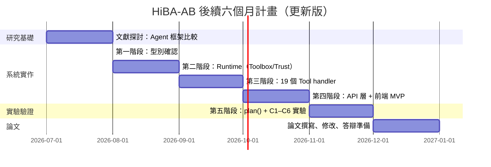

### 11.5 關鍵路徑（最快跑通閉環的路線）

```
material.protectFile 定義完成
    → handler HTTP 呼叫 hiba-core port 8092 成功
        → AuditTrail SQLite 寫入驗證
            → GET /api/tools 回傳 schema
                → Admin 頁 ToolRegistry 瀏覽器顯示
                    → POST /api/execute 直接呼叫成功
                        → C2/C3/C4 實驗基礎就緒
```

整個閉環預計可在第二階段完成後的兩週內跑通，是所有後續工作的信心基石。

---

## 附錄 A：Tool 格式規範快速參考

```typescript
defineTool({
  name: 'material.protectFile',   // {domain}.{verbObject}
  version: '1.0.0',               // semver
  tags: ['material', 'write'],    // 第一個固定 domain，第二個固定 read/write
  description: '將檔案 metadata 上鏈保護',
  inputSchema: z.object({
    filePath: z.string().describe('檔案絕對路徑'),
    keepFile: z.boolean().default(true).describe('是否保留本地檔案'),
  }),
  outputSchema: z.object({
    success: z.boolean().meta({ 'ui:widget': 'status-light' }),
    txHash:  z.string().describe('區塊鏈交易 hash'),
  }),
  permissions: ['material.write'],
  timeout: 30_000,
  retryPolicy: { maxAttempts: 3, initialDelayMs: 500,
                 backoffMultiplier: 2, retryOn: ['TOOL_TIMEOUT'] },
  handler: async (input, ctx) => {
    // 呼叫 hiba-core HTTP API
    const res = await fetch(`${ctx.hibaBaseUrl}/api/blockchain/protect`, {
      method: 'POST',
      headers: {
        'Content-Type': 'application/json',
        'X-Trace-Id': ctx.traceId,
        'X-Agent-Id': ctx.agentId,
        'X-Depth':    String(ctx.depth),
      },
      body: JSON.stringify({ filePath: input.filePath }),
    })
    const data = await res.json()
    return { success: true, txHash: data.txHash }
  }
})
```

## 附錄 B：命名規則速查

| 項目 | 規則 | 範例 |
|------|------|------|
| Tool 名稱 | `{domain}.{verbObject}` | `machine.queryStatus` |
| domain | man / machine / material / method / env | `material` |
| verb 白名單 | query / list / create / update / delete / execute / verify / fetch / report / check / read / calculate / send / record / validate | `query` |
| tags | 第一個 domain，第二個 read 或 write | `['machine', 'read']` |
| 時間欄位 | ISO 8601 字串 | `z.string().datetime()` |
| 錯誤碼 | SCREAMING_SNAKE_CASE | `SCHEMA_VALIDATION_ERROR` |

## 附錄 C：hiba-core 新增端點規格

### C.1 節點能力查詢

```
GET /api/nodes/capabilities?nodeId={nodeId}

Response 200:
{
  "nodeId": "node-08",
  "tools": [
    { "name": "material.protectFile", "version": "1.0.0" },
    { "name": "material.verifyFile",  "version": "1.0.0" }
  ],
  "canInstall": true
}
```

### C.2 AuditTrail 上鏈代理

```
POST /api/audit/anchor

Request:
{
  "anchors": [
    {
      "traceId": "task-abc123-step-001",
      "auditProofHash": "sha256:...",
      "timestamp": "2026-08-01T10:30:00Z"
    }
  ]
}

Response 200:
{
  "txHash": "0x...",
  "anchorsCount": 1
}
```
