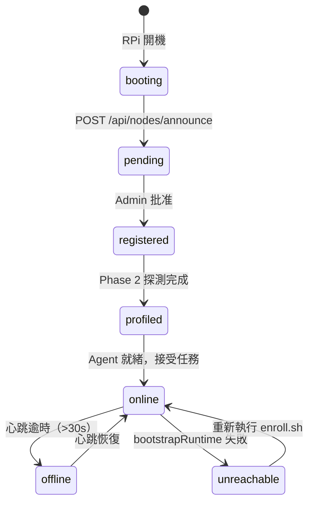
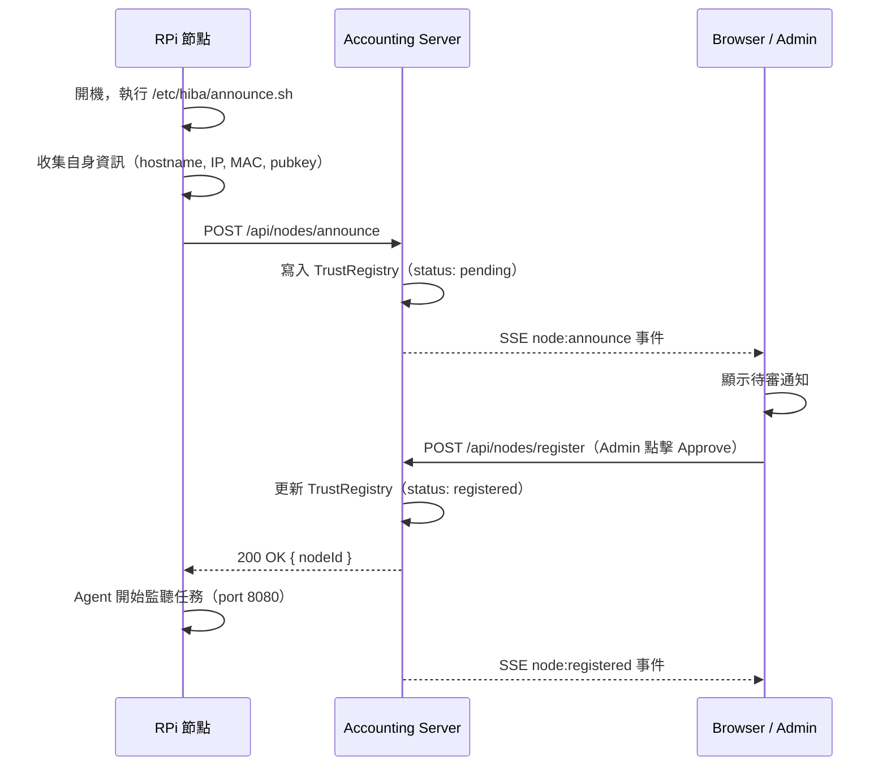
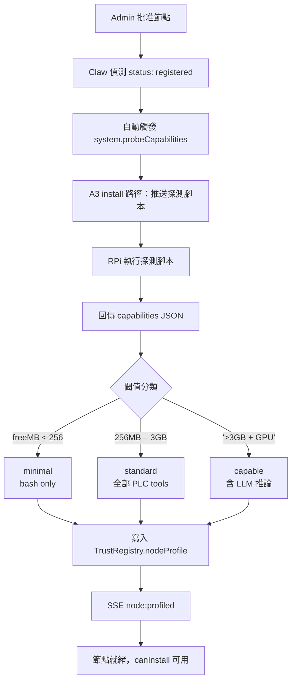
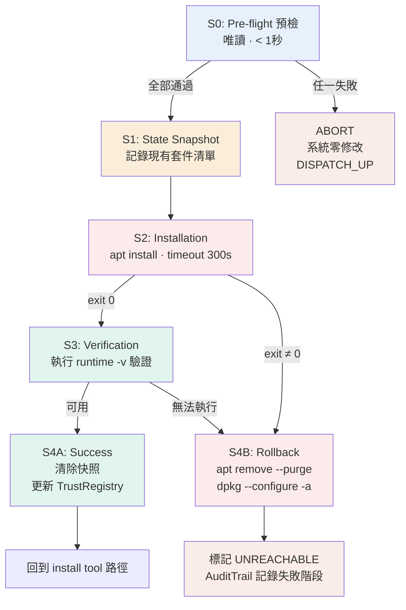

# HiBA-AB Node Management 系統說明文件

> **版本**：v1.0 · 2026-04-08  
> **適用範圍**：Accounting Server（PC + GPU）× 2 Raspberry Pi（無 TPM）測試環境  
> **對應論文章節**：第五章系統實作、公理 A3、定理 T2

---

## 目錄

1. [系統架構概覽](#1-系統架構概覽)
2. [節點生命週期](#2-節點生命週期)
3. [Phase 1：信賴建立](#3-phase-1信賴建立)
4. [Phase 2：算力探測與節點分類](#4-phase-2算力探測與節點分類)
5. [Tool 定義完整規範](#5-tool-定義完整規範)
6. [A3 資源決策（五路徑）](#6-a3-資源決策五路徑)
7. [bootstrapRuntime 安全協議](#7-bootstrapruntime-安全協議)
8. [TrustRegistry SQLite Schema](#8-trustregistry-sqlite-schema)
9. [Sub-web 頁面規範](#9-sub-web-頁面規範)
10. [論文概念對應索引](#10-論文概念對應索引)

---

## 1. 系統架構概覽

### 1.1 三層元件

```
┌─────────────────────────────────────────────────────────┐
│  Accounting Server（PC + GPU，192.168.1.10）             │
│                                                          │
│  ┌─────────────────────┐  ┌────────────────────────┐    │
│  │  HiBA-AB 進程        │  │  Web Frontend          │    │
│  │  Node.js port 3000  │  │  母網站 + sub-web route │    │
│  │  Orchestrator       │  │  Admin + Operator 頁    │    │
│  │  plan() LLM         │  └────────────────────────┘    │
│  │  Toolbox            │                                 │
│  │  TrustRegistry      │  ┌────────────────────────┐    │
│  │  AuditTrail         │  │  SQLite                │    │
│  └─────────────────────┘  │  nodes / tool_registry │    │
│                            │  audit_log             │    │
│                            └────────────────────────┘    │
└─────────────────────────────────────────────────────────┘
         ↕ HTTP (同網域，192.168.1.x)
┌──────────────────────┐   ┌──────────────────────┐
│  RPi-01 (plc-01)     │   │  RPi-02 (plc-02)     │
│  輕量 Agent port 8080 │   │  輕量 Agent port 8080 │
│  ~/.hiba/tools/       │   │  ~/.hiba/tools/       │
│  /tmp/plc-state.json │   │  /tmp/plc-state.json │
└──────────────────────┘   └──────────────────────┘
```

### 1.2 各元件職責

| 元件 | 職責 | 技術 |
|------|------|------|
| Accounting Server | Orchestrator、plan()、TrustRegistry、AuditTrail | Node.js 20、SQLite |
| Web Frontend | 母網站、sub-web route、Admin/Operator GUI | React + SSE |
| RPi Agent | 接收任務、執行腳本、回傳結果 | Node.js 18 lightweight |
| Tool Scripts | 實際業務邏輯（PLC 模擬） | bash / python3 |

---

## 2. 節點生命週期



### 2.1 狀態定義

| 狀態 | 說明 | TrustRegistry 欄位值 |
|------|------|---------------------|
| `pending` | 已宣告，等待 Admin 批准 | `status = 'pending'` |
| `registered` | 批准完成，Phase 2 未執行 | `status = 'registered'` |
| `profiled` | 算力探測完成，profile 已分類 | `node_profile` 已填入 |
| `online` | 正常運作，可接受任務 | `last_seen_at` 持續更新 |
| `offline` | 心跳逾時，暫時不可用 | 自動由 heartbeat worker 標記 |
| `unreachable` | dispatch 失敗超過閾值 | 需人工介入 |

---

## 3. Phase 1：信賴建立

### 3.1 流程圖



### 3.2 開機宣告腳本（`/etc/hiba/announce.sh`）

```bash
#!/bin/bash
# 由 systemd 開機自動執行
# 環境需求：curl, bash（RPi 預設已有）

CLAW_URL="${CLAW_URL:-http://192.168.1.10:3000}"

# 收集系統資訊
HOSTNAME=$(hostname)
IP=$(hostname -I | awk '{print $1}')
MAC=$(cat /sys/class/net/eth0/address 2>/dev/null || \
      cat /sys/class/net/wlan0/address 2>/dev/null || echo "unknown")
PLATFORM=$(uname -s | tr '[:upper:]' '[:lower:]')  # linux
ARCH=$(uname -m)                                     # aarch64
NODE_VER=$(node --version 2>/dev/null || echo "none")

# 讀取已存在的 keypair（首次由 enroll.sh 產生）
PUBKEY=$(cat ~/.hiba/agent.pub 2>/dev/null || echo "")

# 發送宣告
curl -s -X POST "$CLAW_URL/api/nodes/announce" \
  -H "Content-Type: application/json" \
  -d "{
    \"hostname\":    \"$HOSTNAME\",
    \"ip\":          \"$IP\",
    \"mac\":         \"$MAC\",
    \"platform\":    \"$PLATFORM\",
    \"arch\":        \"$ARCH\",
    \"agentPort\":   8080,
    \"publicKey\":   \"$PUBKEY\",
    \"agentVersion\":\"1.0.0\",
    \"bootTime\":    \"$(date -Iseconds)\"
  }"

echo "[hiba] announce sent at $(date)"
```

### 3.3 Announce Payload 格式

```typescript
interface NodeAnnouncePayload {
  hostname:     string;      // "raspberrypi-01"
  ip:           string;      // "192.168.1.11"
  mac:          string;      // "b8:27:eb:4a:xx:xx"
  platform:     string;      // "linux" | "win32" | "darwin"
  arch:         string;      // "aarch64" | "x86_64"
  agentPort:    number;      // 8080
  publicKey:    string;      // RSA 公鑰（PEM 格式）
  agentVersion: string;      // "1.0.0"
  bootTime:     string;      // ISO 8601
}
```

### 3.4 SSE 事件清單

| 事件 | 觸發時機 | Payload |
|------|---------|---------|
| `node:announce` | 收到新節點宣告 | `{ nodeId, ip, mac, status:'pending' }` |
| `node:registered` | Admin 批准完成 | `{ nodeId, profile: null }` |
| `node:profiled` | Phase 2 完成 | `{ nodeId, profile: 'standard' }` |
| `node:online` | 心跳恢復 | `{ nodeId, lastSeen }` |
| `node:offline` | 心跳逾時 | `{ nodeId, offlineSince }` |

---

## 4. Phase 2：算力探測與節點分類

### 4.1 流程圖



### 4.2 探測腳本（`scripts/system.probeCapabilities.sh`）

```bash
#!/bin/bash
CLAW_IP="${1:-192.168.1.10}"

CORES=$(nproc)
MEM_TOTAL=$(free -m | awk '/^Mem:/{print $2}')
MEM_FREE=$(free -m  | awk '/^Mem:/{print $4}')
DISK_FREE=$(df -m / | awk 'NR==2{print $4}')
CPU_LOAD=$(cat /proc/loadavg | awk '{print $1}')

# 執行環境偵測
NODE_VER=$(node    --version  2>/dev/null || echo "none")
PY_VER=$(python3   --version  2>/dev/null | cut -d' ' -f2 || echo "none")
BASH_VER=$(bash    --version  | head -1 | grep -oP '\d+\.\d+' | head -1)

# 套件管理器偵測
PKG_MGRS=""
command -v apt-get &>/dev/null && PKG_MGRS="$PKG_MGRS apt"
command -v pip3    &>/dev/null && PKG_MGRS="$PKG_MGRS pip3"

# sudo 能力（非互動式測試）
HAS_SUDO=$(sudo -n true 2>/dev/null && echo "true" || echo "false")

# 網路連線測試
LATENCY_MS=$(ping -c 3 "$CLAW_IP" -q 2>/dev/null \
  | grep rtt | awk -F'/' '{printf "%d", $5}' || echo "-1")
HAS_INTERNET=$(ping -c 1 -W 3 8.8.8.8 &>/dev/null && echo "true" || echo "false")

cat <<EOF
{
  "cores":         $CORES,
  "memTotalMB":    $MEM_TOTAL,
  "memFreeMB":     $MEM_FREE,
  "diskFreeMB":    $DISK_FREE,
  "cpuLoad1m":     $CPU_LOAD,
  "runtimes": {
    "nodejs":      "$NODE_VER",
    "python3":     "$PY_VER",
    "bash":        "$BASH_VER",
    "powershell":  "none"
  },
  "packageManagers": ["$(echo $PKG_MGRS | tr ' ' '","')"],
  "hasSudo":       $HAS_SUDO,
  "hasInternet":   $HAS_INTERNET,
  "networkLatencyMs": $LATENCY_MS
}
EOF
```

### 4.3 節點分類閾值

```typescript
function classifyNode(cap: Capabilities): NodeProfile {
  if (cap.memFreeMB < 256)  return 'minimal';   // bash only
  if (cap.memFreeMB < 3000) return 'standard';  // 全部 PLC tools
  return 'capable';                              // 含 LLM 推論
}
```

| Profile | freeMB 範圍 | 可安裝 runtime | 預期裝置 |
|---------|-------------|---------------|---------|
| `minimal` | < 256 MB | bash | RPi Zero、舊型嵌入式 |
| `standard` | 256 MB – 3 GB | bash, python3, nodejs | **RPi 4（本測試環境）** |
| `capable` | > 3 GB + GPU | 全部 + LLM | PC accounting server |

> **兩台 RPi 4（4GB）預期 profile：`standard`**  
> 開機後 free RAM ≈ 3000–3500 MB，落在 standard 區間。

---

## 5. Tool 定義完整規範

### 5.1 完整欄位說明

```typescript
defineTool({
  // ── 基本識別 ────────────────────────────────────────
  name:        'env.readTemperature',   // {domain}.{verbObject}
  version:     '1.0.0',                // semver
  description: '讀取溫度感測器（模擬）',
  tags:        ['env', 'read'],        // 第一個 domain，第二個 read/write
  permissions: ['env.read'],           // A2 權限遞減

  // ── Schema ──────────────────────────────────────────
  inputSchema: z.object({
    sensorId: z.string().describe('感測器 ID，如 temp-01'),
  }),
  outputSchema: z.object({
    value:   z.number(),
    unit:    z.string(),
    quality: z.enum(['good', 'bad', 'uncertain']),
  }),

  // ── 執行行為 ─────────────────────────────────────────
  timeout:     5_000,
  retryPolicy: { maxAttempts: 3, initialDelayMs: 500,
                 backoffMultiplier: 2, retryOn: ['TOOL_TIMEOUT'] },

  // ── ★ 安裝條件（canInstall() 讀取）────────────────────
  minProfile:          'minimal',   // 最低節點規格
  runtime:             'bash',      // 需要的執行環境
  requiresNetwork:     false,       // 不需要連外網
  memoryRequirementMB: 8,           // 最低可用記憶體 (MB)
  diskRequirementMB:   1,           // 最低可用磁碟 (MB)

  // ── ★ 多平台腳本 ──────────────────────────────────────
  scripts: {
    linux: 'scripts/env.readTemperature.sh',
    win32: 'scripts/env.readTemperature.ps1',
    // darwin: 選用
  },

  handler: async (input, ctx) => {
    // handler 由 accounting server 執行
    // 實際將腳本推送至目標節點並執行
    const node   = trustRegistry.get(ctx.nodeId);
    const script = tool.scripts[node.platform];
    return await pushAndExecute(node, script, [input.sensorId]);
  },
})
```

### 5.2 安裝條件屬性速查表

| 屬性 | 型別 | 說明 | PLC 腳本典型值 |
|------|------|------|--------------|
| `minProfile` | `'minimal'\|'standard'\|'capable'` | 最低節點規格 | `'minimal'` |
| `runtime` | `'bash'\|'python3'\|'nodejs'\|'ps1'` | 必要執行環境 | `'bash'` |
| `requiresNetwork` | `boolean` | 是否需要連外網 | `false` |
| `memoryRequirementMB` | `number` | 最低可用記憶體 | `8`（bash）`64`（python3） |
| `diskRequirementMB` | `number` | 最低可用磁碟 | `1` |
| `scripts` | `Record<platform, path>` | 平台腳本對應 | `{ linux: '...' }` |

### 5.3 canInstall() 完整判斷邏輯

```typescript
function canInstall(nodeId: string, toolName: string): boolean {
  const node = trustRegistry.getNode(nodeId);
  const tool = toolRegistry.getTool(toolName);
  const cap  = node.capabilities;
  const rank = { minimal: 0, standard: 1, capable: 2 };

  // 1. 節點規格是否達標
  if (rank[node.nodeProfile] < rank[tool.minProfile ?? 'minimal'])
    return false;

  // 2. 執行環境是否存在
  if (tool.runtime && cap.runtimes[tool.runtime] === 'none')
    return false;

  // 3. 網路需求
  if (tool.requiresNetwork && !cap.hasInternet)
    return false;

  // 4. 記憶體是否足夠
  if ((tool.memoryRequirementMB ?? 0) > cap.memFreeMB)
    return false;

  // 5. 磁碟是否足夠
  if ((tool.diskRequirementMB ?? 0) > cap.diskFreeMB)
    return false;

  // 6. 對應平台腳本是否存在
  if (!tool.scripts?.[node.platform])
    return false;

  return true;
}
```

### 5.4 PLC 模擬 Tool 清單（9 個）

#### 機（Machine）域

| Tool 名稱 | runtime | minProfile | requiresNetwork | 說明 |
|-----------|---------|------------|-----------------|------|
| `machine.readStatus` | bash | minimal | false | 讀取機台運行狀態 |
| `machine.readCounter` | bash | minimal | false | 讀取生產計數 |
| `machine.resetCounter` | bash | minimal | false | 重置計數器 |

#### 環（Environment）域

| Tool 名稱 | runtime | minProfile | requiresNetwork | 說明 |
|-----------|---------|------------|-----------------|------|
| `env.readTemperature` | bash | minimal | false | 讀取溫度感測器 |
| `env.readHumidity` | bash | minimal | false | 讀取濕度感測器 |
| `env.checkThreshold` | bash | minimal | false | 判斷感測值是否超閾值 |

#### 料（Material）域

| Tool 名稱 | runtime | minProfile | requiresNetwork | 說明 |
|-----------|---------|------------|-----------------|------|
| `material.recordProduction` | bash | minimal | false | 記錄生產完成 |
| `material.checkStock` | bash | minimal | false | 查詢原料存量 |
| `material.reportAnomaly` | bash | minimal | false | 回報異常事件 |

#### 系統（System）域（特殊）

| Tool 名稱 | runtime | minProfile | requiresNetwork | 說明 |
|-----------|---------|------------|-----------------|------|
| `system.probeCapabilities` | bash | minimal | false | Phase 2 算力探測 |
| `system.bootstrapRuntime` | bash | minimal | **true** | 安裝缺失執行環境 |

---

## 6. A3 資源決策（五路徑）

### 6.1 流程圖

```mermaid
flowchart TD
    START([PlanStep 到達節點]) --> HAS{toolbox.has\ntool?}

    HAS -->|YES| STALE{isStale\nversion?}
    HAS -->|NO|  RT{runtime\nok?}

    STALE -->|NO| EXEC[execute\n直接執行]
    STALE -->|YES| UPDATE[update tool\nre-register]
    UPDATE --> EXEC

    RT -->|YES| INSTALL[install tool\npush + register]
    RT -->|NO|  BOOT{canBootstrap?}
    INSTALL --> EXEC

    BOOT -->|YES| BSTRAP[bootstrapRuntime\napt/pip install]
    BOOT -->|NO|  DISPATCH[DISPATCH_UP\n委派 / 拒絕]
    BSTRAP -->|成功| INSTALL
    BSTRAP -->|失敗| DISPATCH

    EXEC --> AUDIT[AuditTrail.record\npath 標記]
    DISPATCH -.->|error record| AUDIT

    style BSTRAP stroke:#D85A30,stroke-dasharray:5 3
    style DISPATCH fill:#FAECE7
```

### 6.2 五條路徑說明

| 路徑 | 觸發條件 | AuditTrail path 值 | 典型耗時 |
|------|---------|-------------------|---------|
| **直接執行** | tool 存在且版本最新 | `execute` | < 1 秒 |
| **更新執行** | tool 存在但版本過舊 | `update` | 1–3 秒 |
| **安裝執行** | tool 不存在，runtime 可用 | `install` | 1–2 秒 |
| **bootstrap 後執行** | tool 不存在，runtime 缺失但可安裝 | `bootstrap_runtime` | 30 秒–5 分鐘 |
| **委派 / 拒絕** | 以上皆不可行 | `dispatch_up` | 即時 |

### 6.3 canBootstrap() 判斷邏輯

```typescript
function canBootstrap(nodeId: string, runtime: string): boolean {
  const cap = trustRegistry.get(nodeId).capabilities;

  // 需要 sudo（非互動式）
  if (!cap.hasSudo) return false;

  // 需要網路或本地 mirror
  if (!cap.hasInternet && !cap.hasLocalMirror) return false;

  // 需要對應的套件管理器
  const runtimePkgMgr: Record<string, string[]> = {
    python3:    ['apt', 'yum', 'apk'],
    nodejs:     ['apt', 'yum', 'apk'],
    powershell: ['winget', 'choco'],
  };
  const supported = runtimePkgMgr[runtime] ?? [];
  if (!supported.some(m => cap.packageManagers.includes(m))) return false;

  // 磁碟空間（python3 ~60MB，nodejs ~90MB）
  const diskNeeded: Record<string, number> = { python3: 60, nodejs: 90 };
  if (cap.diskFreeMB < (diskNeeded[runtime] ?? 100)) return false;

  return true;
}
```

---

## 7. bootstrapRuntime 安全協議

### 7.1 五階段執行流程



### 7.2 各階段腳本

#### S0：Pre-flight 預檢

```bash
#!/bin/bash
set -e

# 磁碟空間（至少 100MB）
DISK_FREE=$(df -m / | awk 'NR==2{print $4}')
[ "$DISK_FREE" -lt 100 ] && echo '{"abort":"DISK_TOO_LOW"}' && exit 1

# dpkg/apt 鎖定檢查（另一個 apt 正在執行）
fuser /var/lib/dpkg/lock /var/lib/apt/lists/lock &>/dev/null \
  && echo '{"abort":"PKG_MANAGER_LOCKED"}' && exit 1

# dpkg 狀態是否乾淨
dpkg --audit 2>/dev/null | grep -q . \
  && echo '{"abort":"DPKG_INCONSISTENT"}' && exit 1

# 網路連線（ping apt 倉庫）
ping -c 1 -W 3 archive.ubuntu.com &>/dev/null \
  || { echo '{"abort":"NO_NETWORK"}'; exit 1; }

echo '{"preflight":"ok"}'
```

#### S1：State Snapshot

```bash
#!/bin/bash
SNAP_DIR="/tmp/hiba-bootstrap-$(date +%s)"
mkdir -p "$SNAP_DIR"

dpkg -l        > "$SNAP_DIR/packages.txt"
df -m          > "$SNAP_DIR/disk.txt"
env            > "$SNAP_DIR/env.txt"

echo "{\"snapshotDir\":\"$SNAP_DIR\",\"stage\":\"snapshot_ok\"}"
```

#### S2：Installation（以 python3 為例）

```bash
#!/bin/bash
RUNTIME="$1"
SNAP_DIR="$2"

case "$RUNTIME" in
  python3)
    timeout 300 sudo apt-get install -y --no-install-recommends \
      python3 python3-pip
    EXIT_CODE=$?
    ;;
  nodejs)
    curl -fsSL https://deb.nodesource.com/setup_20.x | sudo -E bash -
    timeout 300 sudo apt-get install -y --no-install-recommends nodejs
    EXIT_CODE=$?
    ;;
  *)
    echo "{\"stage\":\"install_failed\",\"reason\":\"UNSUPPORTED_RUNTIME\"}"
    exit 1
    ;;
esac

if [ "$EXIT_CODE" -ne 0 ]; then
  echo "{\"stage\":\"install_failed\",\"exitCode\":$EXIT_CODE}"
  exit 2
fi

echo "{\"stage\":\"install_ok\"}"
```

#### S3：Verification

```bash
#!/bin/bash
RUNTIME="$1"

case "$RUNTIME" in
  python3)
    VERSION=$(python3 --version 2>/dev/null | cut -d' ' -f2)
    python3 -c "import sys; sys.exit(0)" &>/dev/null
    EXEC_OK=$?
    ;;
  nodejs)
    VERSION=$(node --version 2>/dev/null)
    node -e "process.exit(0)" &>/dev/null
    EXEC_OK=$?
    ;;
esac

if [ -z "$VERSION" ] || [ "$EXEC_OK" -ne 0 ]; then
  echo "{\"stage\":\"verify_failed\",\"runtime\":\"$RUNTIME\"}"
  exit 3
fi

echo "{\"stage\":\"verify_ok\",\"version\":\"$VERSION\"}"
```

#### S4B：Rollback

```bash
#!/bin/bash
RUNTIME="$1"
SNAP_DIR="$2"

# 移除剛安裝的套件
sudo apt-get remove --purge -y "$RUNTIME" 2>/dev/null || true
sudo apt-get autoremove -y 2>/dev/null || true

# 修復中斷的 dpkg 狀態（最重要的步驟）
sudo dpkg --configure -a 2>/dev/null || true

# 清除快照
rm -rf "$SNAP_DIR" 2>/dev/null || true

echo "{\"stage\":\"rollback_complete\",\"runtime\":\"$RUNTIME\"}"
```

### 7.3 風險評估

| 階段 | 系統影響 | 失敗後果 | 恢復方式 |
|------|---------|---------|---------|
| S0 | 零（唯讀） | 安全退出 | 自動 DISPATCH_UP |
| S1 | 極小（寫 /tmp） | 安全退出 | 刪除 /tmp 快照 |
| S2 | 有（寫系統套件） | 進入 S4B | apt remove + dpkg fix |
| S3 | 零（唯讀驗證） | 進入 S4B | 同 S2 失敗處理 |
| S4B | 修復性寫入 | 極少數硬體故障時仍不一致 | 重新執行 enroll.sh |

**殘存風險估計**：
- S0 可攔截約 85% 的潛在失敗（磁碟不足、套件鎖定、網路斷線）
- S2+S3 失敗後 dpkg 修復成功率約 95%
- 硬體故障（斷電）導致不一致概率 < 1%
- 終極備案：重新執行 `enroll.sh` 完整重建節點身份

---

## 8. TrustRegistry SQLite Schema

### 8.1 三張表定義

```sql
-- 節點身份與能力
CREATE TABLE nodes (
  node_id       TEXT PRIMARY KEY,
  hostname      TEXT NOT NULL,
  ip            TEXT NOT NULL,
  mac           TEXT UNIQUE NOT NULL,
  public_key    TEXT NOT NULL,          -- PEM 格式公鑰
  platform      TEXT NOT NULL,          -- linux / win32 / darwin
  arch          TEXT,                   -- aarch64 / x86_64
  status        TEXT DEFAULT 'pending', -- pending / registered / online / offline / unreachable
  node_profile  TEXT,                   -- minimal / standard / capable
  capabilities  JSON,                   -- probeCapabilities 完整輸出
  registered_at TEXT,                   -- ISO 8601
  last_seen_at  TEXT                    -- 心跳時間
);

-- Tool 定義持久化
CREATE TABLE tool_registry (
  tool_name            TEXT PRIMARY KEY,
  version              TEXT NOT NULL,
  description          TEXT,
  tags                 JSON,
  permissions          JSON,
  input_schema         JSON,            -- JSON Schema（由 zod 轉換）
  output_schema        JSON,
  min_profile          TEXT DEFAULT 'minimal',
  runtime              TEXT,            -- bash / python3 / nodejs / ps1
  requires_network     INTEGER DEFAULT 0,
  memory_req_mb        INTEGER DEFAULT 0,
  disk_req_mb          INTEGER DEFAULT 0,
  scripts              JSON,            -- { "linux": "path/...", "win32": "path/..." }
  timeout_ms           INTEGER DEFAULT 10000,
  updated_at           TEXT
);

-- 執行稽核記錄（AuditTrail）
CREATE TABLE audit_log (
  id             TEXT PRIMARY KEY,      -- UUID
  trace_id       TEXT NOT NULL,         -- X-Trace-Id header
  step_id        TEXT,
  tool_name      TEXT NOT NULL,
  node_id        TEXT,
  agent_id       TEXT,
  input_hash     TEXT,                  -- SHA-256(input JSON)
  output_hash    TEXT,                  -- SHA-256(output JSON)
  execution_path TEXT,                  -- execute / install / update / bootstrap_runtime / dispatch_up
  success        INTEGER NOT NULL,      -- 0 / 1
  error_code     TEXT,
  duration_ms    INTEGER,
  created_at     TEXT NOT NULL
);
```

### 8.2 建議索引

```sql
CREATE INDEX idx_nodes_status   ON nodes(status);
CREATE INDEX idx_nodes_mac      ON nodes(mac);
CREATE INDEX idx_audit_trace    ON audit_log(trace_id);
CREATE INDEX idx_audit_node     ON audit_log(node_id, created_at DESC);
CREATE INDEX idx_audit_tool     ON audit_log(tool_name, created_at DESC);
```

### 8.3 選用說明

SQLite 對論文測試環境完全足夠：

| 指標 | SQLite 能力 | 本環境需求 |
|------|------------|---------|
| 並發讀取 | 無限制 | 2 台 RPi + 1 Admin |
| 並發寫入 | 串行（可接受） | AuditTrail 非高頻 |
| 最大節點數 | 數千 | 2–10 台 |
| audit_log 大小 | 數 GB | < 10 MB（測試期間） |

未來升級路徑：JSON 欄位改 PostgreSQL JSONB，索引與查詢邏輯不需修改。

---

## 9. Sub-web 頁面規範

### 9.1 架構說明

Sub-web **不是** RPi 上的獨立 web server，而是 Accounting Server 上的一個路由：

```
母網站  →  http://192.168.1.10:3000/
Sub-web →  http://192.168.1.10:3000/nodes/plc-01
           http://192.168.1.10:3000/nodes/plc-02
```

母網站在使用者瀏覽時，向 RPi Agent（`GET /health`、`GET /metrics`）拉取即時資料。**瀏覽器不直接存取 RPi**。

### 9.2 RPi Agent 需暴露的 API

```
GET  /health    → { status, uptime, tools[] }
GET  /metrics   → /tmp/plc-state.json 內容
POST /execute   → 接收 Claw 任務派發
```

### 9.3 Sub-web 五個區塊

| 區塊 | 資料來源 | 更新頻率 |
|------|---------|---------|
| 節點身份 | TrustRegistry（靜態） | 開機時寫入 |
| 已安裝 Tools | Agent GET /health | 開啟頁面時 |
| 即時感測值 | Agent GET /metrics | 每 5 秒輪詢 |
| 最近執行記錄 | AuditTrail 篩選 nodeId | 即時（SSE） |
| 手動執行 Tool | POST /api/execute | 使用者觸發 |

---

## 10. 論文概念對應索引

| 本文件章節 | 論文概念 | 對應位置 |
|-----------|---------|---------|
| Phase 1 信賴建立 | SoftwareAgentIdentity（I6） | 第四章身份系統 |
| Phase 2 算力探測 | A3 資源決策函數 δ | 公理 A3 |
| canInstall() 六條件 | δ 的具體實作 | 定理 T1（遞迴終止） |
| A3 五路徑 | install / update / execute / dispatch 四動作 + bootstrapRuntime | 創新點 I5 |
| bootstrapRuntime S0 預檢 | T2 稽核完整性（零修改也記錄） | 定理 T2 |
| bootstrapRuntime S4B 回滾 | AuditTrail failedAt 欄位 | T2 實驗驗證 |
| Tool minProfile / runtime | canInstall() 完備性 | C6 決策正確率實驗 |
| Sub-web 即時感測值 | C2 投毒攻擊偵測（hash 比對） | 實驗 C2 |
| machine.resetCounter write | C4 權限隔離（TOOL_NOT_FOUND） | 實驗 C4 |
| RPi-02 離線測試 | C5 partial-success 模式 | 實驗 C5 |

---

*文件版本：v1.0 · 產生於 HiBA-AB 設計討論紀錄 · 2026-04-08*
